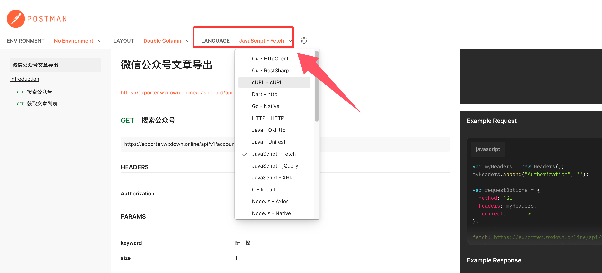

# API 使用说明

本工具提供 RESTful API 接口，方便第三方程序集成和自动化处理。

## 认证方式

所有 API 请求需要在 Header 中携带 `X-Auth-Key` 进行认证：

```
X-Auth-Key: 你的API密钥
```

API 密钥在登录成功后自动生成，可在网站的 API 页面查看。密钥有效期与登录会话一致（4 天）。

## API 端点

基础地址：`https://down.mptext.top`（或你的私有部署地址）

### 搜索公众号

```
GET /api/public/v1/account?keyword=关键词
```

| 参数 | 类型 | 必填 | 说明 |
|------|------|------|------|
| keyword | string | 是 | 公众号名称关键词 |

### 获取文章列表

```
GET /api/public/v1/article?fakeid=xxx&begin=0&size=20
```

| 参数 | 类型 | 必填 | 说明 |
|------|------|------|------|
| fakeid | string | 是 | 公众号的 fakeid |
| begin | number | 否 | 起始位置，默认 0 |
| size | number | 否 | 每页数量，默认 20（最大 20） |
| keyword | string | 否 | 文章标题搜索关键词 |

### 下载文章内容

```
GET /api/public/v1/download?url=文章URL&format=html
```

| 参数 | 类型 | 必填 | 说明 |
|------|------|------|------|
| url | string | 是 | 微信文章 URL |
| format | string | 否 | 输出格式：`html`（默认）/ `markdown` / `text` / `json` |

### 通过文章 URL 获取公众号信息

```
GET /api/public/v1/accountbyurl?url=文章URL
```

| 参数 | 类型 | 必填 | 说明 |
|------|------|------|------|
| url | string | 是 | 微信文章 URL |

### 验证 API 密钥

```
GET /api/public/v1/authkey
```

返回 `code: 0` 表示密钥有效，`code: -1` 表示已过期。

## Postman 在线文档

更详细的 API 文档和示例代码可查看：

https://documenter.getpostman.com/view/1276582/2sB3QDuXUa

在文档页面可选择你的目标编程语言，右侧会自动生成对应的请求代码示例：


