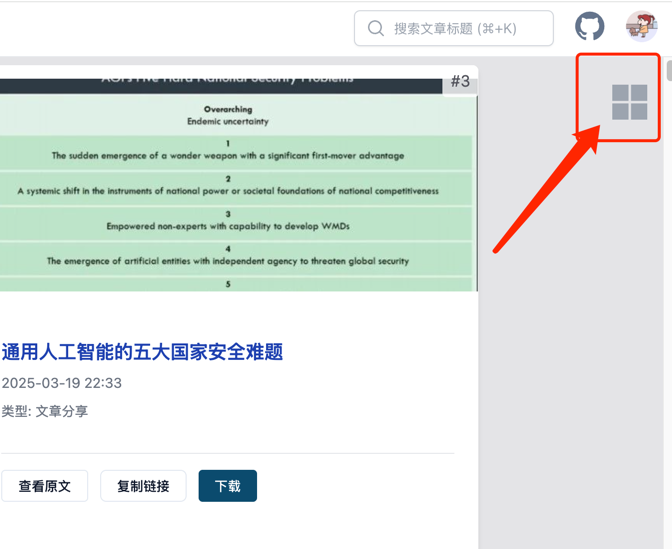
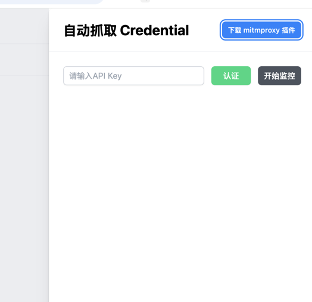
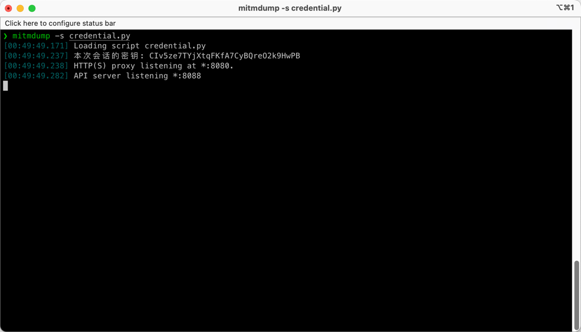
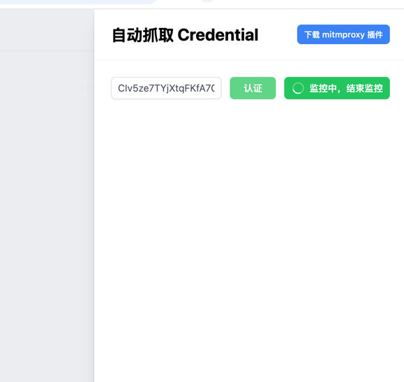
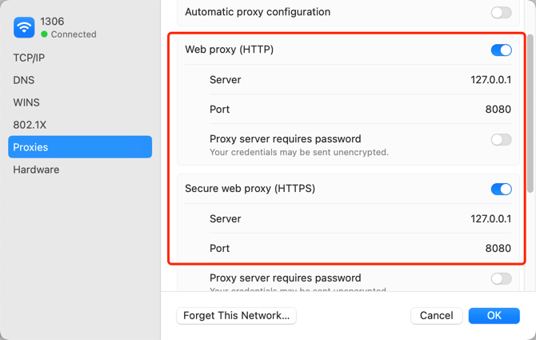
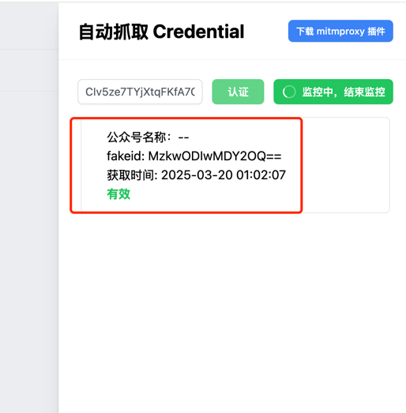

# 抓取 Credential - mitmproxy 插件版

> 注意：本文档内容可能已过时。

为了更好的用户体验，我编写了一个 mitmproxy 插件，用来自动获取公众号的 Credential 数据，从而省去了手动抓包并解析相关参数的繁琐步骤，具体操作可查看以下内容：

打开网站的任意一个页面，都会发现右上角有一个4个小方块的图标，如下图所示：



该图标可在页面上任意拖动位置，松开时会自动停靠在窗口边缘，点击时会打开【自动抓取 Credential】的信息面板，如下图所示：



我们需要下载这个 mitmproxy 插件，该插件的名字为`credential.py`，下载后，执行以下命令启动`mitmproxy`并加载该插件：

```shell
mitmdump -s credential.py -q
```

执行后的结果如下：



可以看到输出一个会话密钥，我们将该密钥填入上面弹框中的`API Key`的输入框中，然后点击【认证】按钮，认证成功后就可以开始进行监控了，如下图所示：



此时我们需要将系统的代理设置为 mitmproxy 的代理，地址为`127.0.0.1:8080`，如下所示：



然后我们就可以在微信中打开目标公众号的任意一篇文章（注意，必须在微信内置浏览器中打开），如果没有监控到的话，就手动刷新一下文章页面，如下图所示：



表示成功抓取到了公众号的 Credential 数据了。

**之后如果发现某个公众号的 Credential 过期了，直接在微信内重新打开他的一篇文章，就可以自动获取到他的最新 Credential 数据了。**

这样在下载文章及评论数据时，就会自动使用该信息进行抓取。

::: warning 注意
由于浏览器对定时器执行频率会有限频，所以最好打开页面的控制台，这样可以防止浏览器休眠页面上的定时器
:::

## 特别说明

上面提到的那个四个方块的图标共有3种状态，对应不同颜色

1. 灰色
表示非监听状态

2. 蓝色
表示正在进行监听，且有效数据大于0

3. 橙色
表示正在监听，且有效数据等于0
