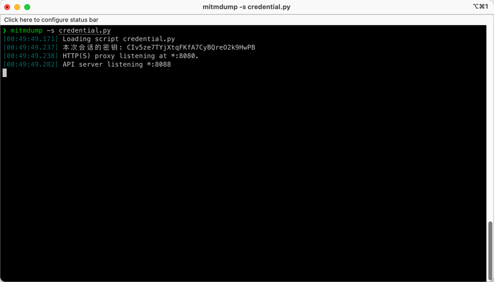
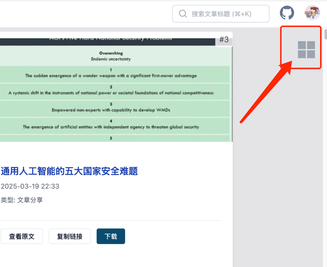
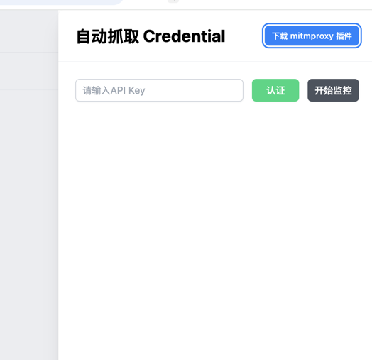
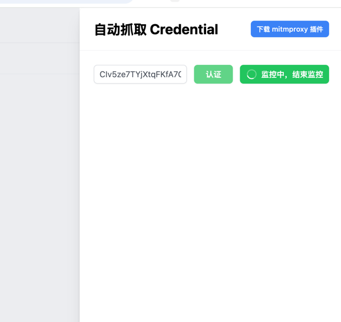
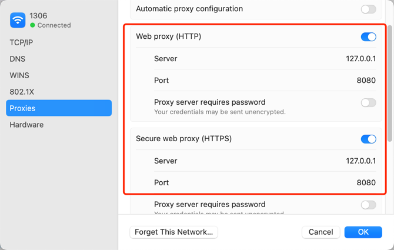
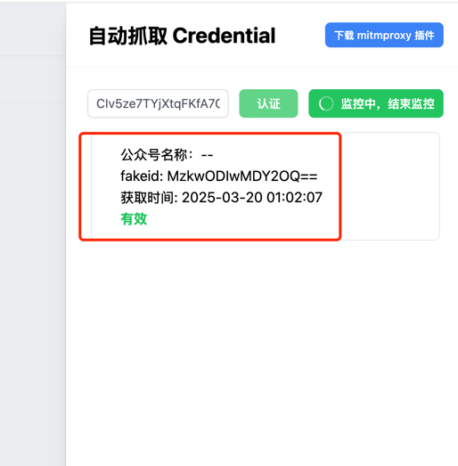

# 抓取 Credential - mitmproxy 插件版

::: warning 推荐使用 wxdown 程序版
本方案需要手动安装和配置 mitmproxy，操作较为复杂。推荐使用更简单的 [wxdown 程序版](wxdown-service)，该方案内置了 mitmproxy，开箱即用。
:::

这是一个 mitmproxy 插件方案，通过加载 `credential.py` 插件来自动抓取公众号的 Credential 数据。

## 两种方案对比

| 项目 | wxdown 程序版（推荐） | mitmproxy 插件版 |
|------|------|------|
| 安装难度 | 低（下载即用） | 高（需安装 mitmproxy） |
| 系统支持 | Windows / macOS | 任意平台 |
| 适用场景 | 大多数用户 | 已有 mitmproxy 环境的开发者 |

## 使用步骤

### 1. 启动 mitmproxy

下载 `credential.py` 插件后，执行以下命令启动 mitmproxy 并加载插件：

```shell
mitmdump -s credential.py -q
```

启动后会输出一个会话密钥：



### 2. 在网站中认证

网站右上角有一个四方块图标，点击可打开「自动抓取 Credential」面板：





将会话密钥填入 `API Key` 输入框中，点击【认证】按钮：



### 3. 设置系统代理

将操作系统的代理设置为 mitmproxy 的监听地址 `127.0.0.1:8080`：



### 4. 抓取 Credential

在微信内置浏览器中打开目标公众号的任意一篇文章。如果未自动抓取到，手动刷新文章页面即可：



抓取成功后，后续只需在微信中重新打开文章即可自动刷新过期的 Credential。

::: warning 注意
请保持网站页面处于活跃状态。由于浏览器会限制后台页面的定时器执行频率，建议打开浏览器的开发者工具（F12）以防止页面被休眠。
:::

## 图标状态说明

网站右上角的四方块图标有 3 种颜色状态：

| 颜色 | 含义 |
|------|------|
| 灰色 | 未连接，不在监听状态 |
| 蓝色 | 正在监听，已抓取到有效数据 |
| 橙色 | 正在监听，但尚未抓取到数据 |
