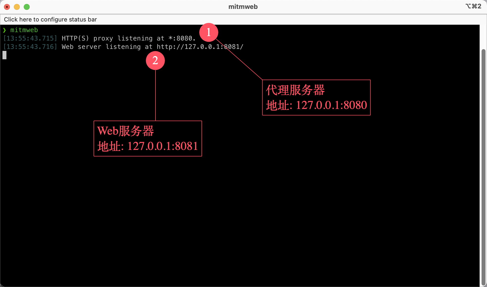
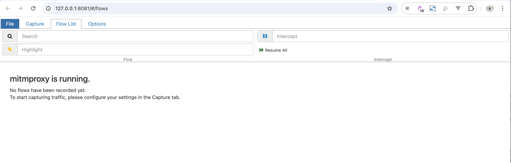
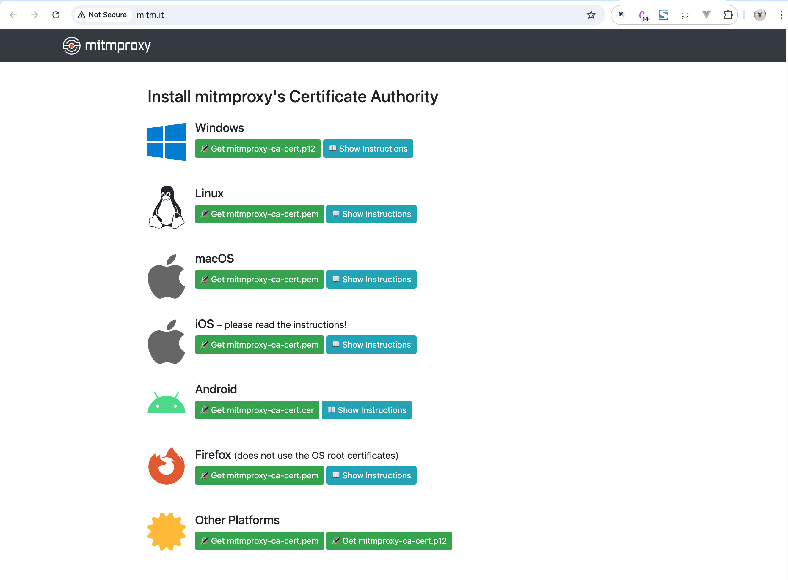
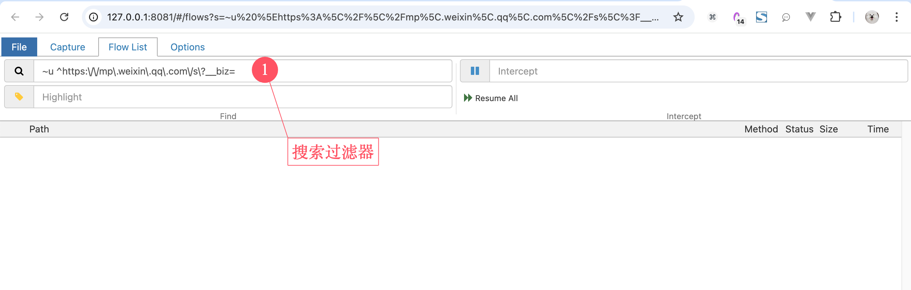
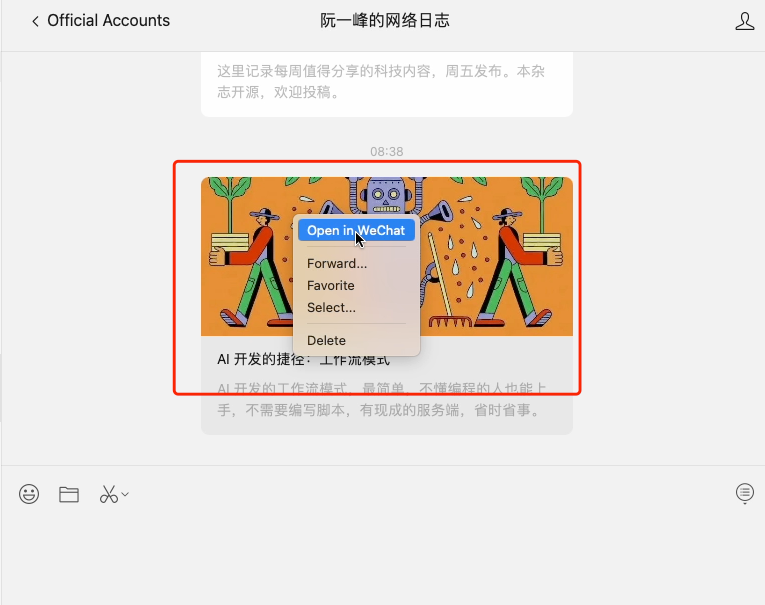
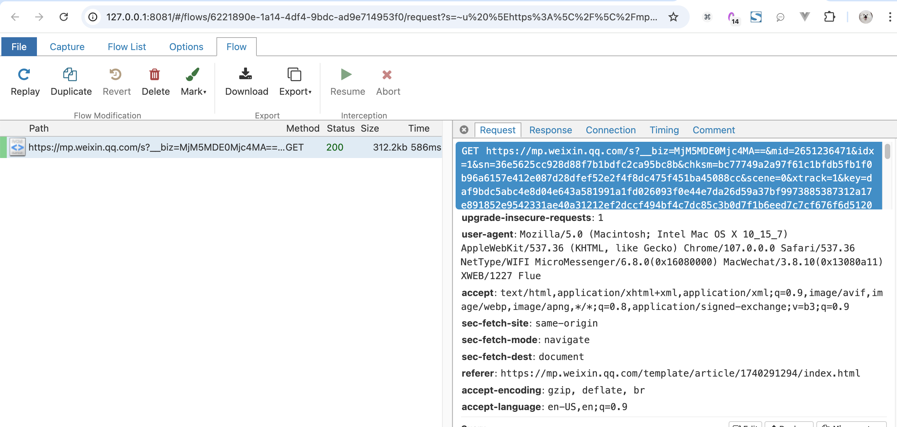
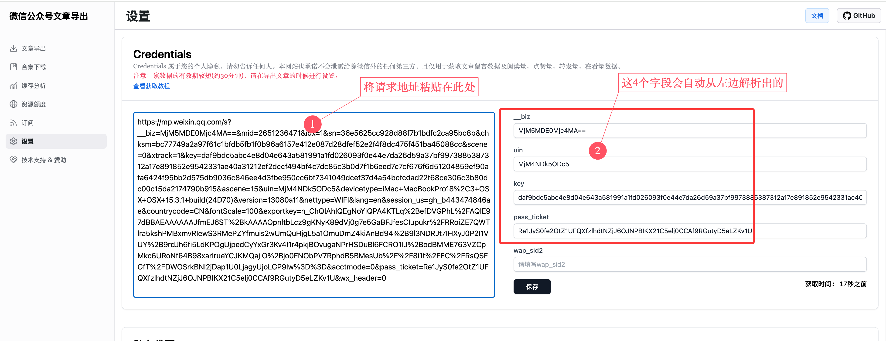
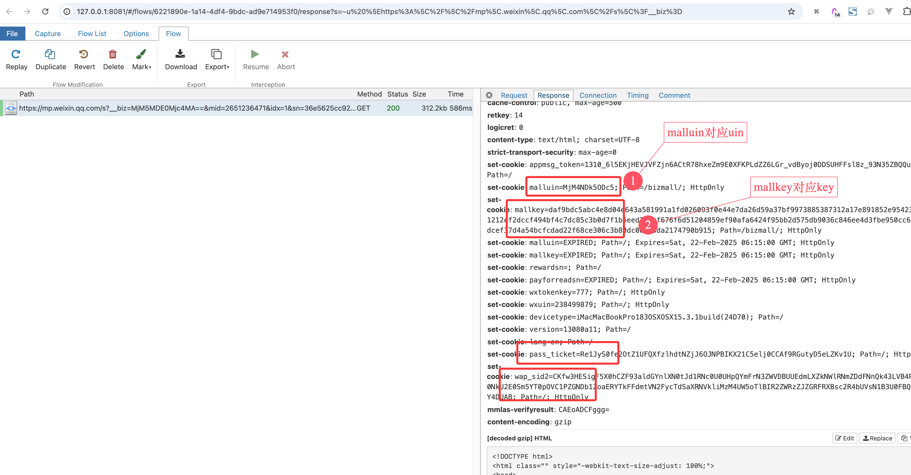
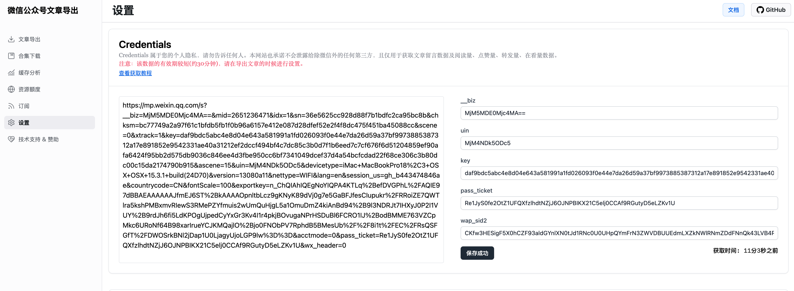

# 如何获取 Credential 信息

::: danger 警告
目前官网已废弃手动抓取 Credential 的方式，该教程仅针对 [私有部署(开源版)](./private-deploy.md) 的网站。

若你使用的是官方部署的 [网站](https://exporter.wxdown.online)，或者部署的 [专业版](./docker-deploy.md)，请参考自动抓取 Credential 教程。
:::

`Credentials`即微信用户的个人凭证，是获取文章的评论和阅读量等数据所必需的。下面说明如何使用 [mitmproxy](https://mitmproxy.org/) 获取该数据：

::: warning 注意
Credentials 的有效期大概为30分钟，推荐在下载文章的时候重新获取。
:::

## 视频版

::: tip 提示
视频里面没有包含 mitmproxy 的安装
:::

<iframe src="//player.bilibili.com/player.html?isOutside=true&aid=114175179296703&bvid=BV1hoQeYWEf4&cid=28905639284&p=1" scrolling="no" border="0" frameborder="no" framespacing="0" allowfullscreen="true" style="width:100%;height:400px;"></iframe>

## 文字版

### 1. 安装 `mitmproxy`

按照官方的 [安装教程](https://docs.mitmproxy.org/stable/overview-installation/) 在你的系统上安装该工具。

### 2. 配置 `mitmproxy`

在控制台启动`mitmweb`，如下所示:



该命令会自动打开浏览器，展示抓包列表界面(后面会用到)：



从控制台可以看到`mitmproxy`命令启动了一个代理服务器，地址为`127.0.0.1:8080`，我们将浏览器或系统的代理设置为`127.0.0.1:8080`，然后浏览器访问 http://mitm.it/

如果显示的是下面的界面，则说明系统代理设置有误:


如果系统的代理设置正确，则会出现下面的界面(提示安装证书):



下载对应系统的证书文件并安装进系统中。证书安装之后，`mitmproxy`的配置就完成了。

### 3. 抓取 Credentials

重启`mitmweb`，然后浏览器打开抓包页面，搜索过滤器设置为:
```
~u ^https:\/\/mp\.weixin\.qq\.com\/s\?__biz=
```

如下图所示：




用电脑端微信打开 **目标公众号** 的任意一篇文章，如下图所示:




然后从`mitmproxy`拦截的请求中找到该请求，复制请求路径并粘贴进系统中:





如果复制的请求地址没有自动解析出右边的4个字段，则可以手动填写这些信息，对应关系如下图所示：



填写完毕之后记得保存。

这样在下载文章的时候就可以同时拉取留言数据和阅读量、转发量、点赞量、在看量数据啦。


