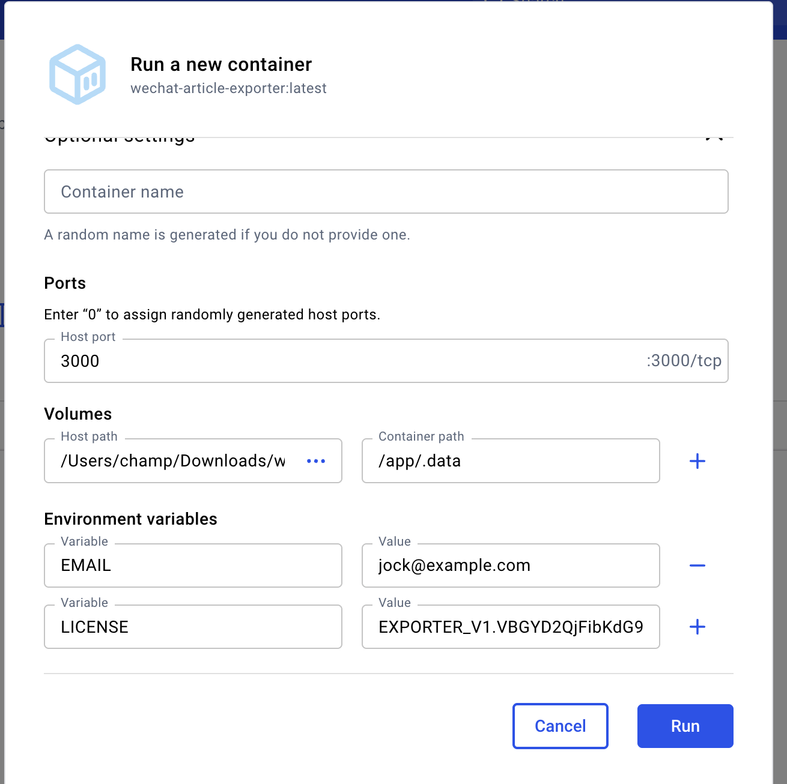
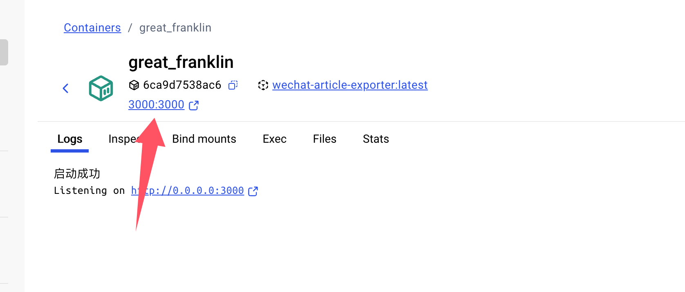

# 私有部署 - v2

::: warning 注意
v2版目前正在优化中，可能存在明显bug。
:::


## 获取授权
~~已赞助用户可在微信联系我免费获取授权码。~~

代码已完全开源，可本地运行（需要 >=node18 环境）。


## 本地运行

### 拉取代码

```shell
git clone git@github.com:wechat-article/wechat-article-exporter.git
```

### 切换到 v2 分支

```shell
git switch v2.0
```

### 安装依赖

```shell
yarn
```

或者

```shell
npm install
```

### 启动

```shell
yarn dev
```

或者

```shell
npm run dev
```


## docker 运行

### 拉取镜像

```shell
docker pull jooooock/wechat-article-exporter:latest
```

### 启动容器

启动容器的方式有下面 2 种，根据你自己的情况选择其中一种：

#### 1. 命令行启动

```shell
docker run -d --rm -p 3000:3000 -v /app/.data:/app/.data jooooock/wechat-article-exporter:latest
```

#### 2. Docker 桌面程序启动

启动参数如下：



启动成功可直接点击这里打开浏览器：



## 浏览器访问

浏览器打开 `http://localhost:3000` 即可使用专业版功能。
