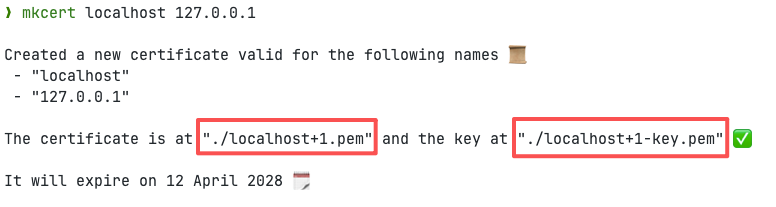

# 私有部署

::: warning 注意
公共代理节点仅限于以下域名使用:
- https://down.mptext.top
- http://localhost
- http://127.0.0.1

如果私有部署后访问的域名不在以上名单中，则需要使用自己搭建的节点。
:::

## 本地运行

> 需要 node >=22 环境

### 拉取代码

```shell
git clone git@github.com:wechat-article/wechat-article-exporter.git
```

### 安装依赖

```shell
yarn
```


### 启动

```shell
yarn dev
```


## docker 运行

### 拉取镜像

```shell
docker pull ghcr.io/wechat-article/wechat-article-exporter:latest
```

### 启动容器

> 容器暴露的端口号为3000，内部存储目录为/app/.data

```shell
docker run -d --rm \
  --restart always \
  --network host \
  --name wechat-article-exporter \
  -p 3000:3000 \
  -v .data:/app/.data \
  ghcr.io/wechat-article/wechat-article-exporter:latest
```

## 浏览器访问

浏览器打开 `http://localhost:3000` 即可使用专业版功能。


## docker compose + mkcert 自签名证书

### 使用`mkcert`生成自签名证书

> `mkcert`的安装及使用可以查看[官方文档](https://github.com/FiloSottile/mkcert?tab=readme-ov-file#mkcert)

```shell
# 在系统中安装根证书(只需执行一次)
mkcert -install
```

执行以下代码生成本地 IP 对应的证书文件:
```shell
# 这里可以列出你最终访问的ip
mkcert localhost 127.0.0.1 ::1
```

该命令会生成2个`pem`文件，分别对应证书和密钥文件，如下图所示:


将这两个文件重命名为`cert.pem`和`key.pem`，并放在`certs`目录中。

### 拷贝`nginx.conf`和`docker-compose.yaml`文件

```nginx configuration
# nginx.conf 文件
server {
    listen 80;
    server_name localhost;

    # HTTP 自动重定向到 HTTPS
    return 301 https://$host$request_uri;
}

server {
    listen 443 ssl;
    server_name localhost;

    # SSL 证书路径（根据你实际文件名调整）
    ssl_certificate /etc/nginx/certs/cert.pem;
    ssl_certificate_key /etc/nginx/certs/key.pem;

    # 推荐的 SSL 配置（增强安全性）
    ssl_protocols TLSv1.2 TLSv1.3;
    ssl_ciphers HIGH:!aNULL:!MD5;
    ssl_prefer_server_ciphers on;

    location / {
        proxy_pass http://app:3000;  # 代理到应用容器
        proxy_set_header Host $host;
        proxy_set_header X-Real-IP $remote_addr;
        proxy_set_header X-Forwarded-For $proxy_add_x_forwarded_for;
        proxy_set_header X-Forwarded-Proto $scheme;
        proxy_set_header X-Forwarded-Host $host;
    }
}
```

```yaml
# docker-compose.yml 文件
services:
  app:
    image: ghcr.io/wechat-article/wechat-article-exporter:latest
    restart: always
    volumes:
      # 持久化 KV 数据（防止容器重启丢失）
      - .data:/app/.data

  nginx:
    image: nginx:alpine
    container_name: wechat-article-nginx
    restart: always
    ports:
      - "80:80"    # HTTP（会自动重定向到 HTTPS）
      - "443:443"  # HTTPS
    volumes:
      - ./certs:/etc/nginx/certs:ro          # 挂载证书（只读）
      - ./nginx.conf:/etc/nginx/conf.d/default.conf:ro  # 挂载配置
    depends_on:
      - app
```

将以上所有文件放在一个目录中，比如`app`目录，最终的目录结构如下:
```text
app
├── certs
│   ├── cert.pem
│   └── key.pem
├── docker-compose.yml
└── nginx.conf
```
在该目录中执行`docker compose up -d`启动，然后就可以通过`https://localhost`(或者你的本地ip)访问 https 网站程序了。


## Vercel 快速部署

### 一键部署

点击下方按钮一键部署到 Vercel：

[](https://vercel.com/new/clone?repository-url=https://github.com/wechat-article/wechat-article-exporter)

### 手动部署

1. Fork 本项目到你的 GitHub 账号

2. 在 Vercel 中导入项目
   - 访问 [Vercel](https://vercel.com)
   - 点击 "Add New..." → "Project"
   - 选择你 Fork 的项目仓库

3. 配置项目
   - Framework Preset: 选择 `Nuxt.js`
   - Root Directory: 保持默认 `./`
   - Build Command: 保持默认或使用 `yarn build`
   - Output Directory: 保持默认 `.output/public`

4. 配置环境变量（可选）
   - 在项目设置中添加所需的环境变量（见下方环境变量说明）

5. 点击 "Deploy" 完成部署


## 环境变量

某些功能需要设置环境变量，比如访客统计、错误日志上报、AG-Grid授权码等。

以下列出了所有支持的环境变量，本地运行时可直接在项目根目录创建`.env`文件，docker运行时可通过`--env-file .env`选项传入环境变量启动。

### AG-Grid 企业版授权

```dotenv
# AG-Grid 企业版授权
NUXT_AGGRID_LICENSE=
```

### 调试微信代理请求(仅开发环境支持)

```dotenv
# 调试微信代理请求 (仅开发环境(development)支持)
NUXT_DEBUG_MP_REQUEST=true
```

### umami 网站统计

```dotenv
# umami 网站统计
# https://umami.nuxt.dev/api/configuration
NUXT_UMAMI_ID=
NUXT_UMAMI_HOST=
```

### sentry
```dotenv
# sentry
# https://docs.sentry.io/platforms/javascript/guides/nuxt/manual-setup/
NUXT_SENTRY_DSN=
NUXT_SENTRY_ORG=
NUXT_SENTRY_PROJECT=
NUXT_SENTRY_AUTH_TOKEN=
```

### kv绑定
```dotenv
# KV绑定(本地/docker)
NITRO_KV_DRIVER=fs
NITRO_KV_BASE=.data/kv

# KV绑定(cloudflare)
#NITRO_KV_DRIVER=cloudflare-kv-binding
```
