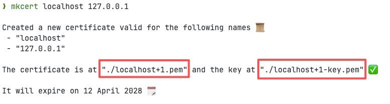

# 私有部署

::: warning 注意
公共代理节点仅限于以下域名使用：
- `https://down.mptext.top`
- `http://localhost`
- `http://127.0.0.1`

如果私有部署后使用其他域名访问，需要 [搭建自己的代理节点](../get-started/private-proxy)。
:::

## 本地运行

适合开发者调试或临时使用，需要 Node.js >= 22 环境。

```shell
# 拉取代码
git clone git@github.com:wechat-article/wechat-article-exporter.git
cd wechat-article-exporter

# 安装依赖
yarn

# 启动开发服务器
yarn dev
```

启动后打开 `http://localhost:3000` 即可使用。

## Docker 运行（推荐）

适合长期使用，无需搭建开发环境。

### 拉取镜像

```shell
docker pull ghcr.io/wechat-article/wechat-article-exporter:latest
```

### 启动容器

容器暴露端口 3000，内部数据目录为 `/app/.data`。

::: code-group
```shell [Linux]
docker run -d \
  --restart always \
  --name wechat-article-exporter \
  -p 3000:3000 \
  -v ./.data:/app/.data \
  ghcr.io/wechat-article/wechat-article-exporter:latest
```

```shell [macOS / Windows]
docker run -d \
  --restart always \
  --name wechat-article-exporter \
  -p 3000:3000 \
  -v ./.data:/app/.data \
  ghcr.io/wechat-article/wechat-article-exporter:latest
```
:::

::: tip 提示
`-v ./.data:/app/.data` 会将容器内的数据映射到当前目录的 `.data` 文件夹，确保容器重启后数据不丢失。
:::

启动后打开 `http://localhost:3000` 即可使用。


## docker compose + mkcert 自签名证书

### 使用`mkcert`生成自签名证书

> `mkcert`的安装及使用可以查看[官方文档](https://github.com/FiloSottile/mkcert?tab=readme-ov-file#mkcert)

```shell
# 在系统中安装根证书(只需执行一次)
mkcert -install
```

执行以下代码生成本地 IP 对应的证书文件:
```shell
# 这里可以列出你最终访问的ip
mkcert localhost 127.0.0.1 ::1
```

该命令会生成2个`pem`文件，分别对应证书和密钥文件，如下图所示:


将这两个文件重命名为`cert.pem`和`key.pem`，并放在`certs`目录中。

### 拷贝`nginx.conf`和`docker-compose.yaml`文件

```nginx configuration
# nginx.conf 文件
server {
    listen 80;
    server_name localhost;

    # HTTP 自动重定向到 HTTPS
    return 301 https://$host$request_uri;
}

server {
    listen 443 ssl;
    server_name localhost;

    # SSL 证书路径（根据你实际文件名调整）
    ssl_certificate /etc/nginx/certs/cert.pem;
    ssl_certificate_key /etc/nginx/certs/key.pem;

    # 推荐的 SSL 配置（增强安全性）
    ssl_protocols TLSv1.2 TLSv1.3;
    ssl_ciphers HIGH:!aNULL:!MD5;
    ssl_prefer_server_ciphers on;

    location / {
        proxy_pass http://app:3000;  # 代理到应用容器
        proxy_set_header Host $host;
        proxy_set_header X-Real-IP $remote_addr;
        proxy_set_header X-Forwarded-For $proxy_add_x_forwarded_for;
        proxy_set_header X-Forwarded-Proto $scheme;
        proxy_set_header X-Forwarded-Host $host;
    }
}
```

```yaml
# docker-compose.yml 文件
services:
  app:
    image: ghcr.io/wechat-article/wechat-article-exporter:latest
    restart: always
    volumes:
      # 持久化 KV 数据（防止容器重启丢失）
      - .data:/app/.data

  nginx:
    image: nginx:alpine
    container_name: wechat-article-nginx
    restart: always
    ports:
      - "80:80"    # HTTP（会自动重定向到 HTTPS）
      - "443:443"  # HTTPS
    volumes:
      - ./certs:/etc/nginx/certs:ro          # 挂载证书（只读）
      - ./nginx.conf:/etc/nginx/conf.d/default.conf:ro  # 挂载配置
    depends_on:
      - app
```

将以上所有文件放在一个目录中，比如`app`目录，最终的目录结构如下:
```text
app
├── certs
│   ├── cert.pem
│   └── key.pem
├── docker-compose.yml
└── nginx.conf
```
在该目录中执行`docker compose up -d`启动，然后就可以通过`https://localhost`(或者你的本地ip)访问 https 网站程序了。


## Vercel 快速部署

### 一键部署

点击下方按钮一键部署到 Vercel：

[](https://vercel.com/new/clone?repository-url=https://github.com/wechat-article/wechat-article-exporter)

### 手动部署

1. Fork 本项目到你的 GitHub 账号

2. 在 Vercel 中导入项目
   - 访问 [Vercel](https://vercel.com)
   - 点击 "Add New..." → "Project"
   - 选择你 Fork 的项目仓库

3. 配置项目
   - Framework Preset: 选择 `Nuxt.js`
   - Root Directory: 保持默认 `./`
   - Build Command: 保持默认或使用 `yarn build`
   - Output Directory: 保持默认 `.output/public`

4. 配置环境变量（可选）
   - 在项目设置中添加所需的环境变量（见下方环境变量说明）

5. 点击 "Deploy" 完成部署


## 环境变量

以下环境变量均为可选项。本地运行时在项目根目录创建 `.env` 文件即可；Docker 运行时通过 `--env-file .env` 传入。

### 数据存储（KV）

登录会话等数据通过 KV 存储持久化，不同部署方式配置不同：

```dotenv
# 本地 / Docker 部署（基于文件系统）
NITRO_KV_DRIVER=fs
NITRO_KV_BASE=.data/kv

# Cloudflare 部署（使用 Cloudflare KV）
# NITRO_KV_DRIVER=cloudflare-kv-binding
```

### 调试模式

```dotenv
# 调试微信代理请求（仅开发环境生效）
NUXT_DEBUG_MP_REQUEST=true
```

### AG-Grid 企业版授权

```dotenv
# 文章列表使用 AG-Grid 展示，企业版授权可解锁更多功能
NUXT_AGGRID_LICENSE=
```

### 网站统计（umami）

```dotenv
# https://umami.nuxt.dev/api/configuration
NUXT_UMAMI_ID=
NUXT_UMAMI_HOST=
```

### 错误监控（Sentry）

```dotenv
# https://docs.sentry.io/platforms/javascript/guides/nuxt/manual-setup/
NUXT_SENTRY_DSN=
NUXT_SENTRY_ORG=
NUXT_SENTRY_PROJECT=
NUXT_SENTRY_AUTH_TOKEN=
```
