# 抓取 Credential - wxdown 程序版

为了更好的使用体验，我用 python 编写了一个独立的控制台程序，用来抓取公众号的 Credential 数据，该程序打包了 mitmproxy，可独立运行，具体操作可查看以下内容：


::: tip 提示
本程序代码开源，项目地址 https://github.com/wechat-article/wxdown-service
:::


## 下载软件

根据你的操作系统，下载对应的软件程序。该软件是一个控制台程序，不需要进行安装，可直接运行。

下载地址: https://github.com/wechat-article/wxdown-service/releases

> 注意：macOS用户可能需要下载源码在本地用 python 运行

## Windows 运行

下载并解压后程序如下图所示：


### 1. 启动软件

可直接双击`wxdown-service.exe`开始执行，启动过程中可能需要一些权限，请全部允许。

启动成功后如下所示：

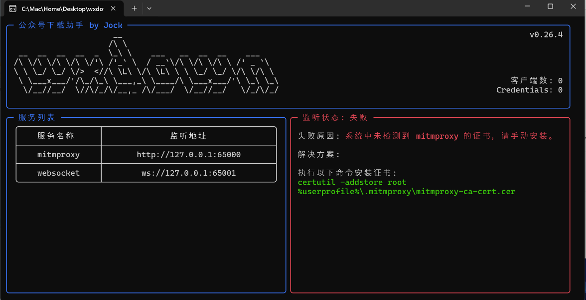

### 2. 安装证书

提示需要安装 mitmproxy 的证书，用管理员启动 cmd 程序，执行下面的代码，如下：

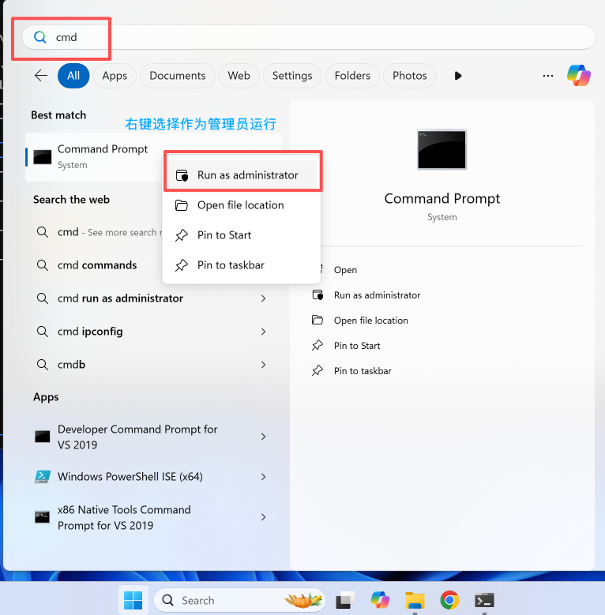

在 cmd 中执行下面的代码：
```cmd
certutil -addstore root %userprofile%\.mitmproxy\mitmproxy-ca-cert.cer
```

执行结果如下：

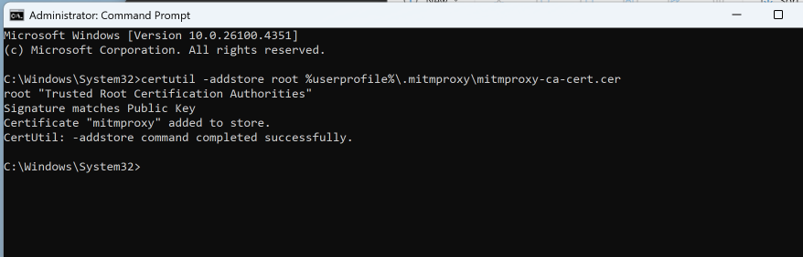

如果对命令行不熟悉，也可以找到证书文件手动安装。

证书文件路径为`%userprofile%\.mitmproxy\mitmproxy-ca-cert.cer`
在文件管理器中打开上面这个地址，如下：

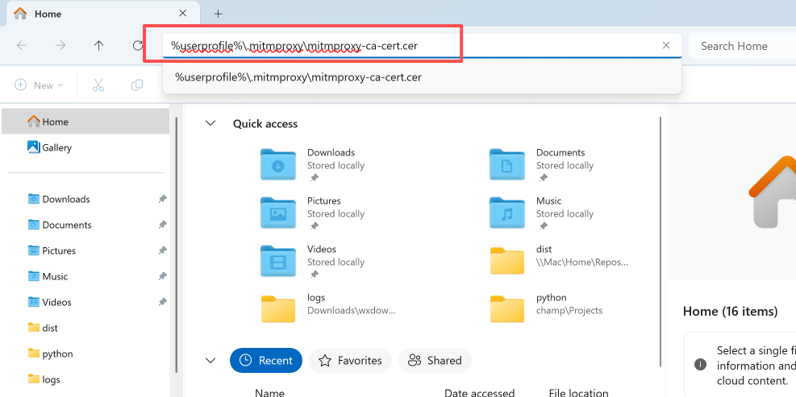

安装证书：


选择本地计算机：

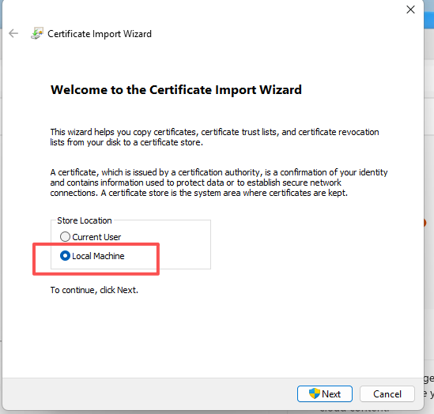

证书位置选择【受信任的根证书颁发机构】：


证书安装完成之后，软件界面如下：

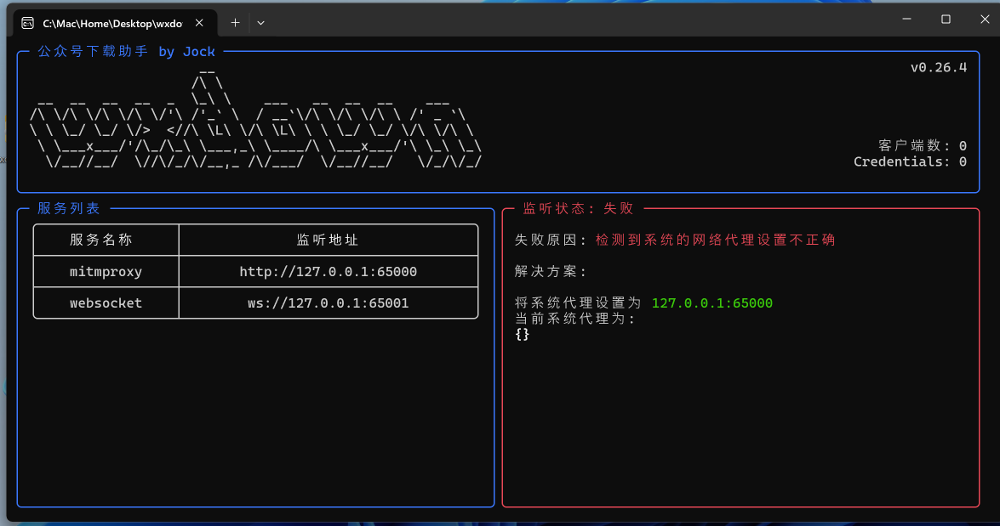

### 3. 设置操作系统代理

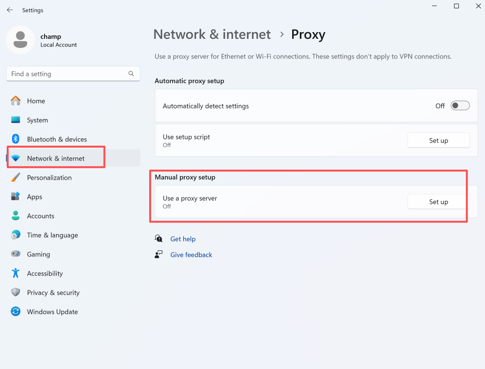


设置成功后软件界面如下：

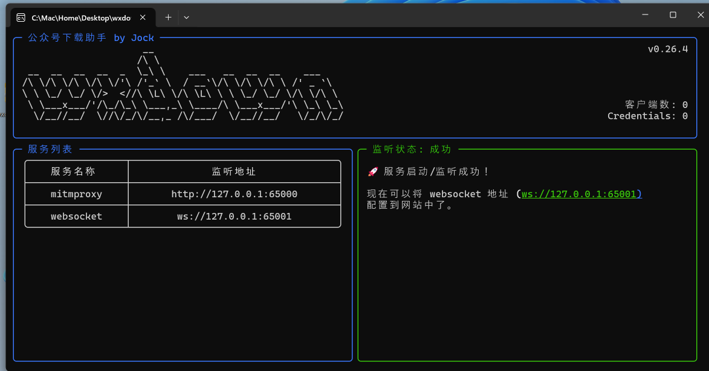

## macOS 运行

下载源码，在根目录执行
```shell
pip install -r requirements.txt
python main.py
```

跟上面 Windows 一样，需要安装证书和设置操作系统代理。

安装证书命令：
```shell
sudo security add-trusted-cert -d -p ssl -p basic -k /Library/Keychains/System.keychain ~/.mitmproxy/mitmproxy-ca-cert.pem
```

设置操作系统代理：

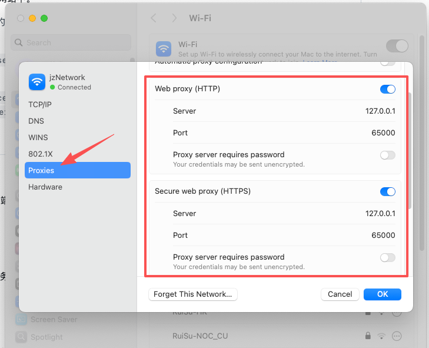

设置成功后界面如下：

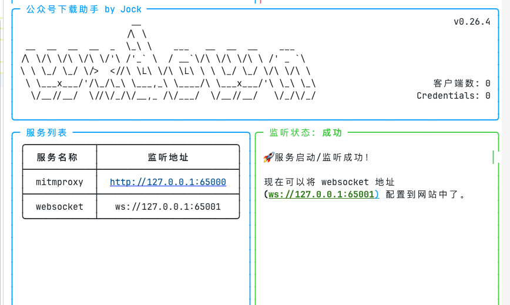

## 抓取 Credentials

当你的`wxdown-service`程序成功运行之后，网站的图标会变成绿色，如下图所示：

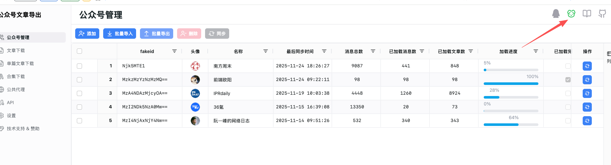

点开之后如下所示：

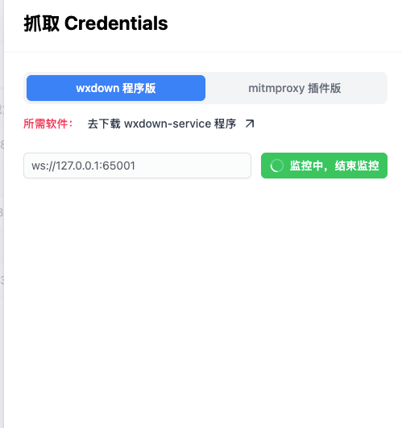

现在，你需要在电脑端的微信客户端打开目标公众号的一篇文章

> 注意，这里必须使用微信内置浏览器打开


如果网站上没有出现你打开的公众号信息，则点击微信浏览器左上角的刷新按钮，这时就成功抓取到了该公众号的 Credentials 数据了。

接着就可以开始抓取该公众号的阅读量和留言数据了。

> 注意：
> 1. 抓取到的 Credentials 数据有效期为30分钟，过期后就无法再抓取这些数据了。
> 2. 成功抓取到 Credentials 之后，你可以关闭 wxdown-service 程序。
> 3. Credentials 过期后，你只需要重新刷新下微信浏览器的文章，就会自动获取新的 Credentials (前提是你没有关闭 wxdown-service 程序，并且也没有修改过操作系统代理)。
