# 抓取 Credential - wxdown 程序版（推荐）

wxdown-service 是一个独立运行的控制台程序，用于自动抓取微信公众号的 Credential 数据（阅读量、评论等接口所需的认证信息）。该程序内置了 mitmproxy，无需额外安装依赖。

::: tip 提示
本程序代码开源，项目地址：https://github.com/wechat-article/wxdown-service
:::

## 工作原理

wxdown-service 通过在本地启动一个 HTTP 代理（mitmproxy），拦截微信客户端访问公众号文章时的请求，从中提取 Credential 参数（`biz`、`uin`、`key`、`pass_ticket` 等），并自动同步到网站。

## 下载软件

根据你的操作系统下载对应的版本：

下载地址：https://github.com/wechat-article/wxdown-service/releases

| 平台 | 文件 | 说明 |
|------|------|------|
| Windows | `wxdown-service.exe` | 可直接运行，无需安装 |
| macOS | 源码 | 需要 Python 环境运行 |

## Windows 运行

下载并解压后程序如下图所示：

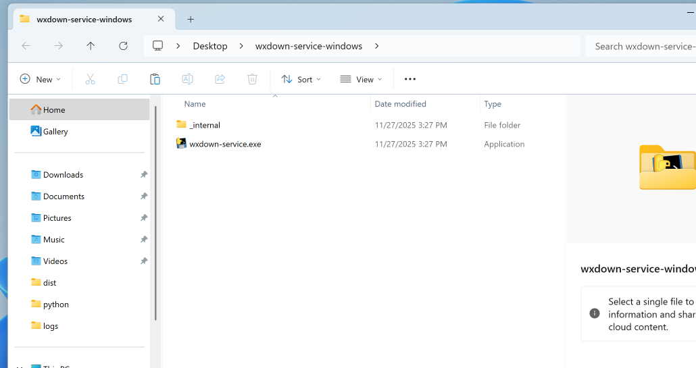

### 1. 启动软件

双击 `wxdown-service.exe` 启动，启动过程中可能需要管理员权限和网络访问权限，请全部允许。

启动成功后如下所示：

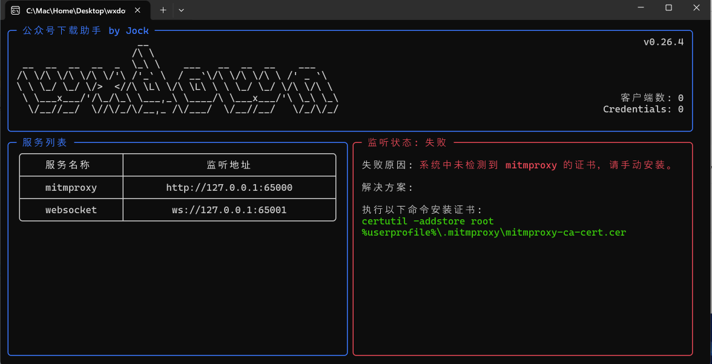

### 2. 安装证书

首次运行需要安装 mitmproxy 的 CA 证书，以便解密 HTTPS 请求。

**方式一：命令行安装（推荐）**

以管理员身份打开 cmd，执行：

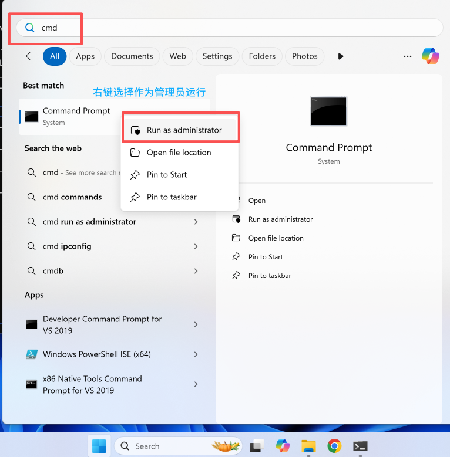

```cmd
certutil -addstore root %userprofile%\.mitmproxy\mitmproxy-ca-cert.cer
```

执行结果如下：

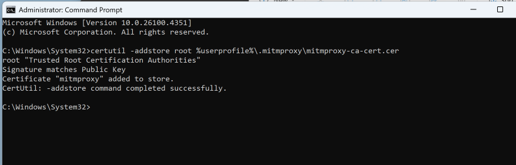

**方式二：手动安装**

如果不熟悉命令行，可以在文件管理器中打开 `%userprofile%\.mitmproxy\` 目录，找到 `mitmproxy-ca-cert.cer` 文件：

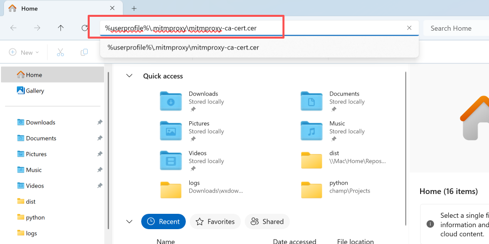

双击证书文件，按照向导安装：

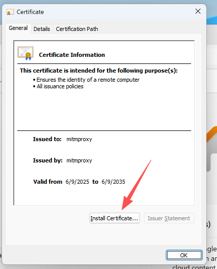

选择「本地计算机」：

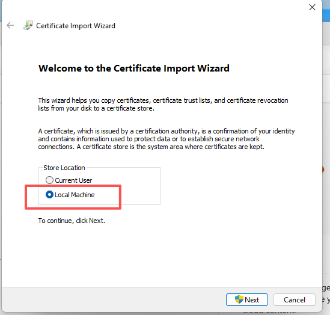

证书存储位置选择「受信任的根证书颁发机构」：

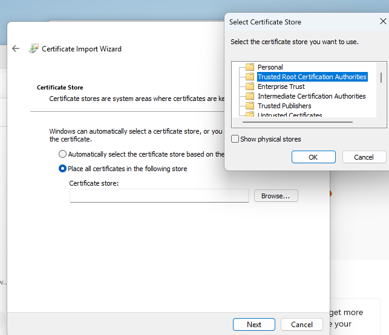

证书安装完成后，软件界面如下：

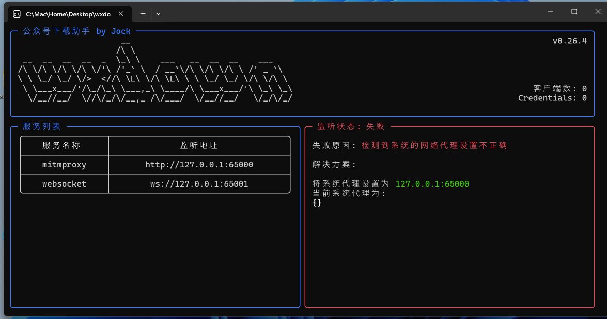

### 3. 设置操作系统代理

将系统代理设置为 `127.0.0.1:8080`（mitmproxy 的默认监听地址）：

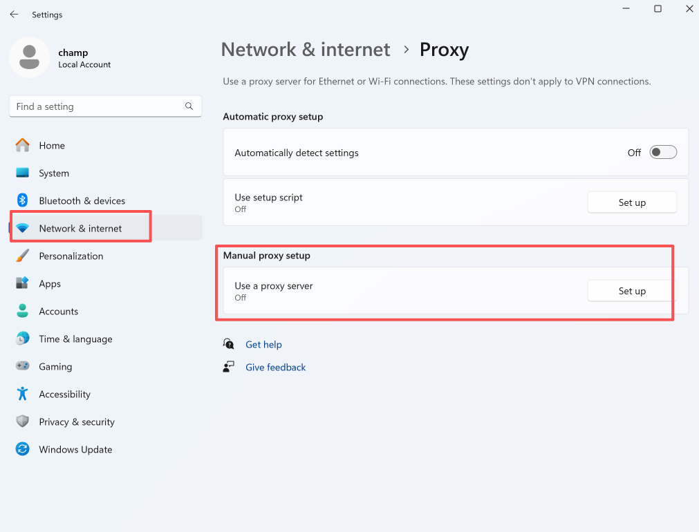

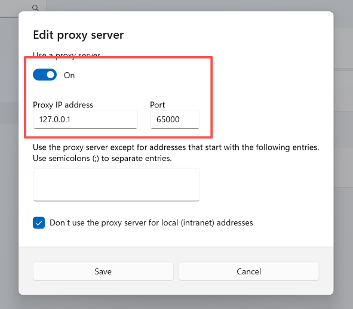

设置成功后软件界面如下：

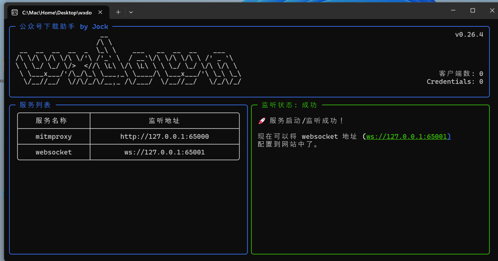

## macOS 运行

macOS 暂无打包版本，需要从源码运行。

### 1. 安装依赖并启动

确保已安装 Python 3，然后执行：

```shell
# 克隆项目
git clone https://github.com/wechat-article/wxdown-service.git
cd wxdown-service

# 安装依赖
pip install -r requirements.txt

# 启动程序
python main.py
```

### 2. 安装证书

```shell
sudo security add-trusted-cert -d -p ssl -p basic -k /Library/Keychains/System.keychain ~/.mitmproxy/mitmproxy-ca-cert.pem
```

### 3. 设置系统代理

打开「系统设置」→「网络」→「Wi-Fi」→「代理」，将 HTTP 和 HTTPS 代理都设置为 `127.0.0.1:8080`：

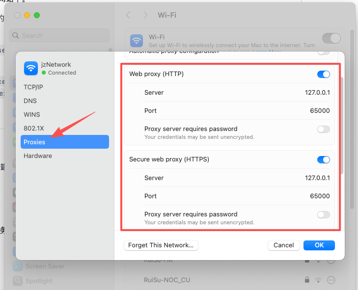

设置成功后界面如下：

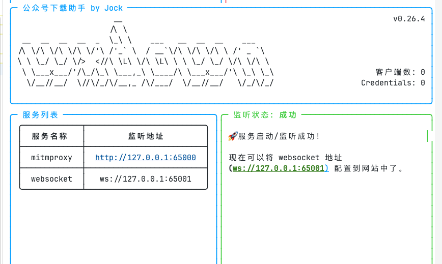

## 抓取 Credentials

wxdown-service 启动成功后，网站右上角的图标会变成绿色，表示已连接：

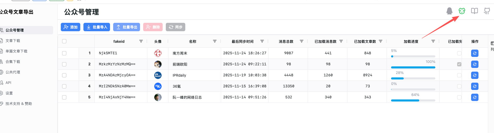

点击图标查看面板：

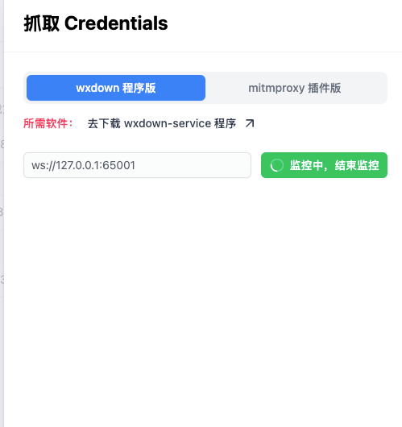

现在，在 **电脑端微信客户端** 中打开目标公众号的任意一篇文章：

::: warning 注意
必须在微信内置浏览器中打开文章，不能使用系统浏览器。
:::

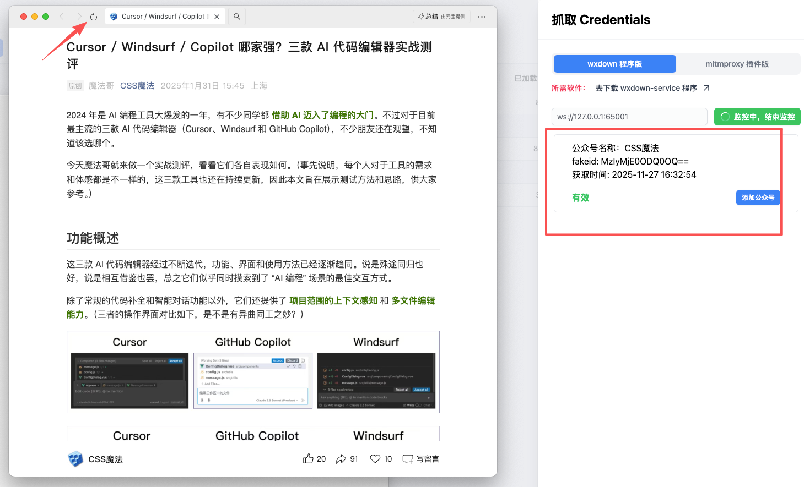

如果网站上没有显示该公众号信息，点击微信浏览器左上角的 **刷新按钮** 重新加载文章页面即可。

抓取成功后，就可以在网站上抓取该公众号的阅读量和评论数据了。

## 注意事项

| 事项 | 说明 |
|------|------|
| 有效期 | Credentials 有效期约 **25 分钟**，过期后无法继续抓取阅读量和评论 |
| 数据缓存 | 抓取成功后数据会缓存在浏览器中，此时可以关闭 wxdown-service 程序 |
| 刷新方式 | 过期后只需在微信中重新打开/刷新一篇文章即可自动获取新的 Credentials |
| 持续抓取 | 如需长时间持续抓取，请保持 wxdown-service 运行且系统代理不要关闭 |

## 常见问题

**Q: 证书安装后仍然无法抓取？**
- 确认系统代理已正确设置为 `127.0.0.1:8080`
- 重启微信客户端后再试
- Windows 用户确认证书安装到了「受信任的根证书颁发机构」

**Q: macOS 提示权限不足？**
- 证书安装命令需要 `sudo` 权限
- 如遇安全提示，在「系统设置」→「隐私与安全性」中允许运行

**Q: 批量下载过程中 Credentials 过期了怎么办？**
- 已下载的数据不受影响
- 在微信中重新打开一篇该公众号的文章刷新 Credentials，然后继续抓取即可
