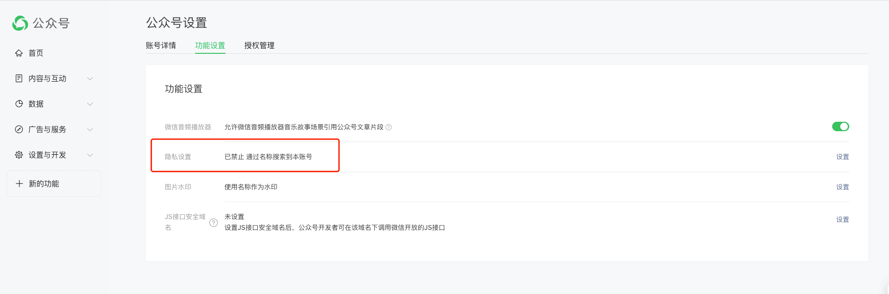

# FAQ

[[toc]]

## 出现 `200002:invalid args` 如何解决？

出现该错误的原因可能是多方面的，需要逐一排查。

首先确认扫码登录时使用的是 **服务号**，而非 **小程序**，如下图所示：

其次，由于该项目的原理是基于公众号后台的公众号文章搜索功能，因此目标公众号必须开启 **允许通过名称搜索** 才能获取到文章数据，如下图所示：

某些公众号搜索不到也可能是因为没有开启这个选项导致的。

## 登录页面为什么不显示二维码？

这通常出现在私有部署的网站，由于微信返回的相关 cookie 使用了 `secure` 属性，所以要求网站必须开启 https 才能携带 cookie。

## 如何获取评论和阅读量、点赞量、转发量这些数据？

这些数据都是需要微信用户的信息才能抓取到，所以需要先获取用户的这些信息，然后设置到网站中，才能在下载文章时一并抓取这些信息。

具体如何获取微信用户的信息，可以查看 [如何获取 Credentials 信息](advanced/credentials)。

## 下载文章时提示 "无可用代理" 是怎么回事？

由于公共代理资源有限(一个月只有500GB的流量)，仅支持测试时使用。如果想要正式使用，请根据教程搭建自己的私有下载节点，并配置进系统中。

查看 [搭建私有代理节点](get-started/private-proxy) 教程。

## 出现 Array buffer allocation failed 如何解决？

这个是因为一次性下载太多导致内存不足导致的，属于程序bug，目前正在优化。
