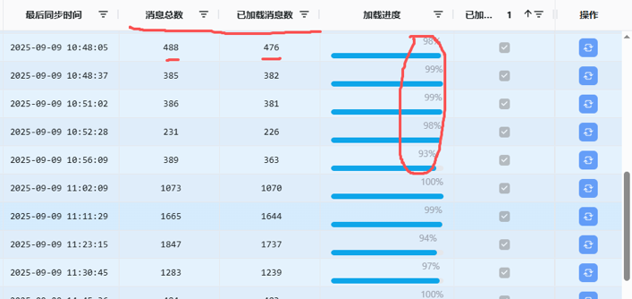
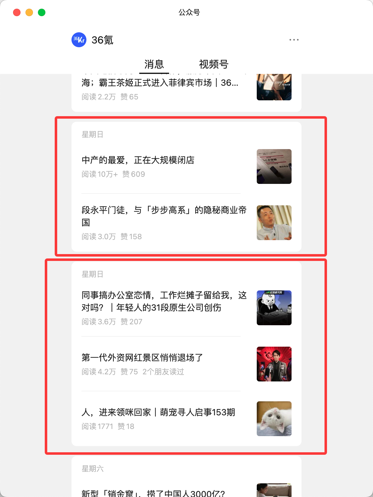
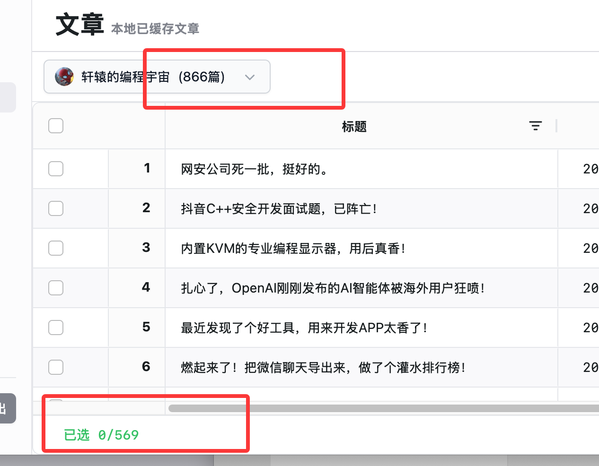
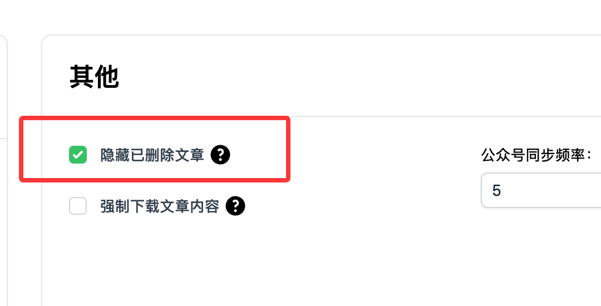
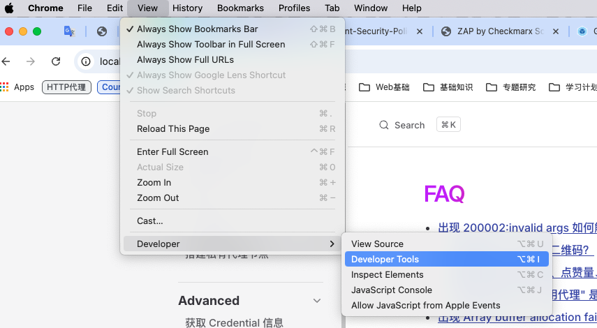
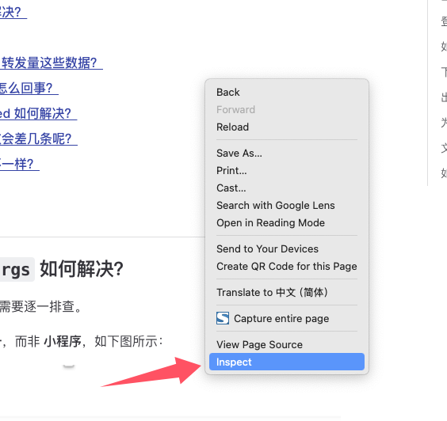
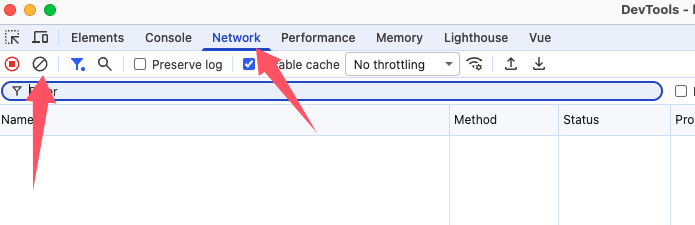

# 常见问题 (FAQ)

[[toc]]

## 出现 `200002:invalid args` 如何解决？

出现该错误的原因可能是多方面的，需要逐一排查。

首先确认扫码登录时使用的是 **服务号** 或者 **公众号**，而非 **小程序**，如下图所示：

其次，由于该项目的原理是基于公众号后台的公众号文章搜索功能，因此目标公众号必须开启 **允许通过名称搜索** 才能获取到文章数据，如下图所示：

某些公众号搜索不到也可能是因为没有开启这个选项导致的。

## 登录页面为什么不显示二维码？

这通常出现在私有部署的网站，由于微信返回的相关 cookie 使用了 `secure` 属性，所以要求网站必须开启 https 才能携带 cookie。

## 如何获取评论和阅读量、点赞量、转发量这些数据？

这些数据都需要使用微信用户的信息才能抓取到，所以需要先获取用户的这些信息(本程序称之为 **Credentials**)，然后设置到网站中，才能抓取这些数据。

具体如何获取微信用户的信息(Credentials)，可以查看 [抓取 Credentials](advanced/wxdown-service.md)。

## 下载文章时提示 "无可用代理" 是怎么回事？

由于公共代理资源有限(一个月只有500GB的流量)，仅支持测试时使用。如果想要正式使用，请根据教程搭建自己的私有下载节点，并配置进系统中。

查看 [搭建私有代理节点](get-started/private-proxy) 教程。

## 为什么已加载的消息数和消息总数会差几条呢？

上面这个就是消息，每条消息可能会包含多篇文章，这个列表里面已加载消息数就是指的抓取到的这个消息数量，是准确的，消息总数是微信接口返回的一个字段，叫`total_count`，这个是我猜的消息总数，所以不一定准确。

## 文章下载页面的文章数量为什么不一样？

这是因为网站设置里默认启用了【隐藏已删除文章】的选项，可以手动关闭这个选项，这两个数字就一致了。

## 如何检查请求失败原因？

有时候可能因为各种原因导致获取数据失败，此时需要一步步进行排查，其中最主要的就是检查网络请求。

下面就说明一下如何自行排查网络请求

### 第一步，打开浏览器的开发者工具面板

菜单如下：

或者在网页上右键，选择【inspect】

### 第二步，捕获请求

切换到【网络】面板，然后点击左边的清空按钮，将之前的网络请求清空，进行全新的捕获。

这一步做完之后，就可以在页面上进行操作了，比如抓取评论。操作完成后，网络面板就会记录所有的网络请求，可以点开对应的网络请求查看返回的具体内容。
如果对网络请求不了解，也可以将请求的内容截图发群里咨询大佬们解答。
