# 常见问题 (FAQ)

[[toc]]

## 出现 `200002:invalid args` 如何解决？

该错误通常由以下原因导致，请逐一排查：

**1. 登录账号类型不正确**

扫码登录时必须选择 **公众号** 或 **服务号**，不能使用 **小程序** 登录：

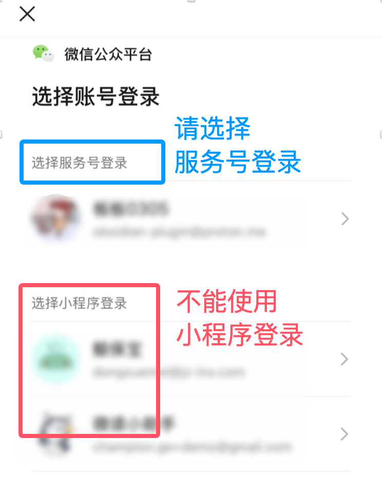

**2. 目标公众号未开启搜索**

本工具基于公众号后台的文章搜索接口获取数据，目标公众号必须开启「允许通过名称搜索」选项，否则无法搜索到该公众号：

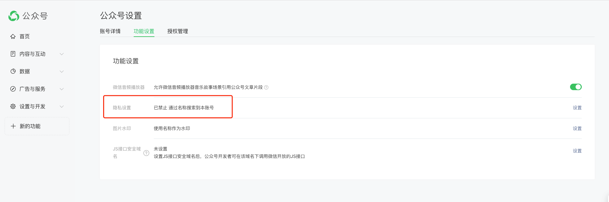

**3. 登录已过期**

登录凭证（auth-key）有效期为 4 天，过期后需要重新扫码登录。

## 登录页面为什么不显示二维码？

这通常出现在私有部署的网站上。微信返回的登录 Cookie 带有 `Secure` 属性，要求网站必须通过 HTTPS 访问才能正常携带 Cookie。

**解决方案：**
- 使用 `localhost` 或 `127.0.0.1` 访问（不受此限制）
- 为私有部署配置 HTTPS 证书，参考 [Docker Compose + mkcert 方案](advanced/private-deploy#docker-compose-mkcert-自签名证书)

## 如何获取评论和阅读量数据？

阅读量、点赞数、转发量和评论数据需要通过微信用户身份才能获取，本工具将这些身份信息统称为 **Credentials**。

获取流程：
1. 使用 [wxdown-service](advanced/wxdown-service) 程序启动本地代理
2. 在微信客户端中打开目标公众号的一篇文章
3. 程序自动抓取 Credentials 并同步到网站

::: warning 注意
Credentials 有效期约 **25 分钟**，过期后需要在微信中重新打开文章页面以刷新。
:::

详细操作请查看 [抓取 Credentials](advanced/wxdown-service)。

## 已加载消息数和消息总数为什么不一致？

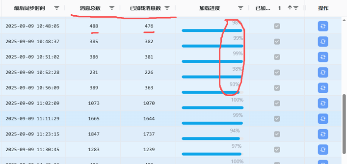

首先需要理解 **消息** 和 **文章** 的区别：

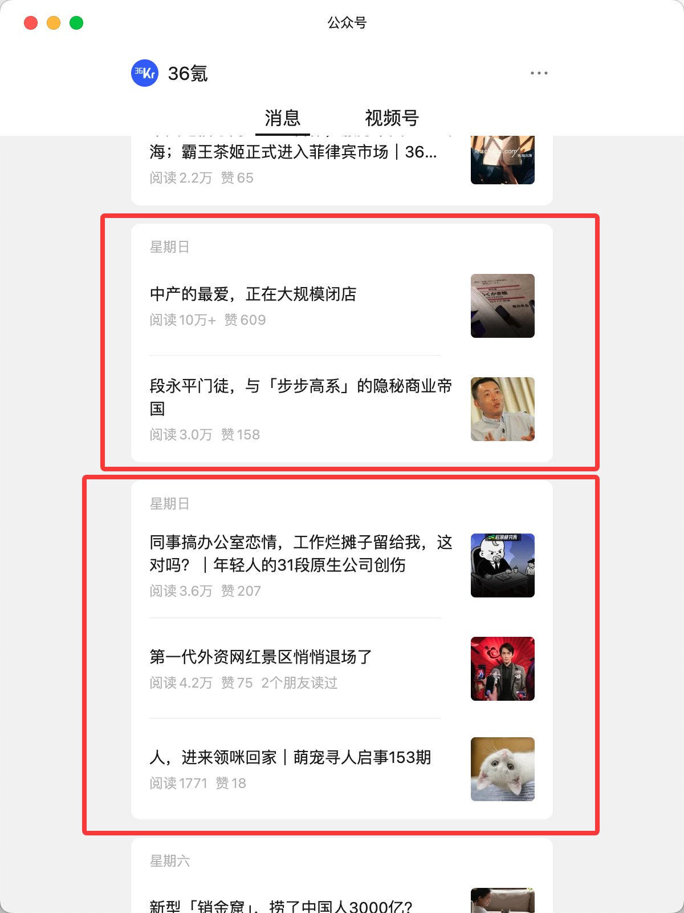

如上图所示，红框中的是 **2 条消息**，但每条消息可能包含多篇文章（类似于一期推送中的多篇图文）。

- **已加载消息数**：实际从微信接口拉取到的消息数量，该数值是准确的
- **消息总数**：微信接口返回的 `total_count` 字段，作为参考值，不一定完全准确

## 文章下载页面的文章数量为什么不一样？

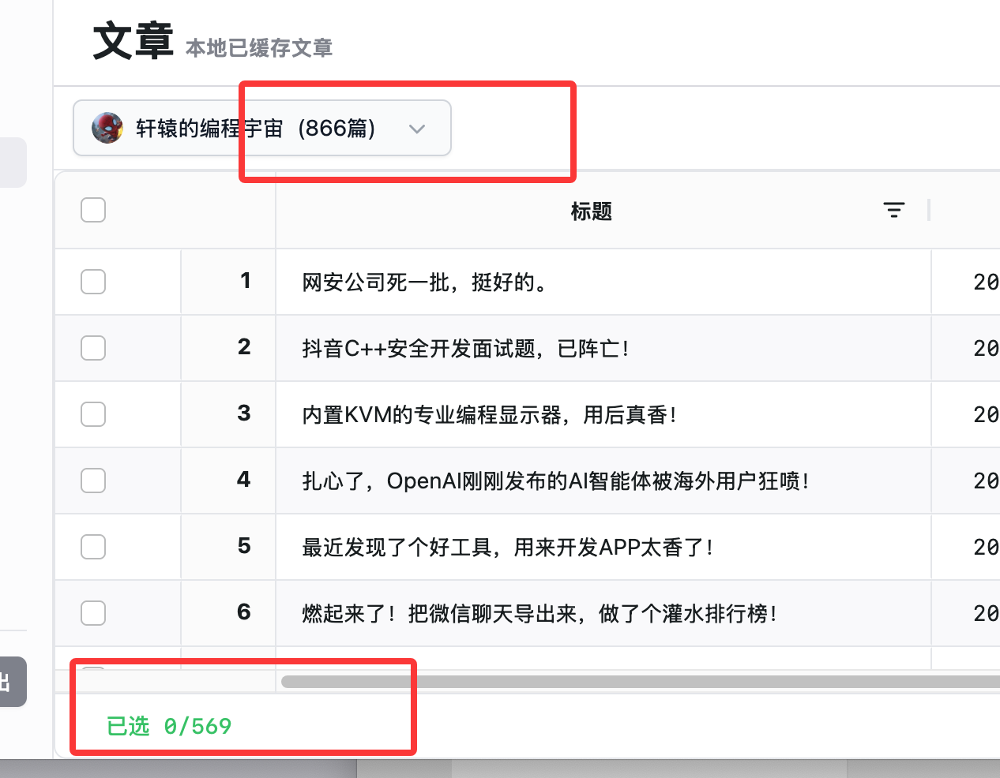

这是因为默认启用了「隐藏已删除文章」选项。已删除的文章在同步时仍会被获取到，但在文章列表中默认隐藏。

关闭该选项后，两个数字会保持一致：

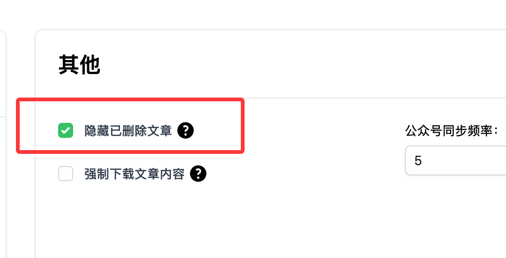

## 请求出现 `429` 状态码

`429` 表示请求过于频繁，通常是公共代理节点的当日额度用完了。

**解决方案：**
- 搭建自己的 [私有代理节点](get-started/private-proxy)（推荐）
- 等待次日北京时间 8:00 额度自动刷新

参考 [GitHub Issue #119](https://github.com/wechat-article/wechat-article-exporter/issues/119)

## 目标公众号 Credential 未设置

该提示出现在抓取阅读量或评论数据时，表示对应公众号的 Credential 尚未获取或已过期。

请参考 [抓取 Credential](advanced/wxdown-service) 教程获取 Credential 后再进行抓取。

## 无法打开此文件夹，因为其中含有系统文件

导出时不能选择系统保护的目录（如「下载」、「文档」等系统目录）。请手动创建一个新目录（如桌面上新建一个「导出文件」文件夹），然后选择该目录进行导出。

## 如何清理数据

工具中的文章数据（除单篇文章下载外）都存储在浏览器本地的 IndexedDB 数据库中，有以下几种清理方式：

### 方法 1：删除指定公众号数据

在【公众号管理】页面，选择对应的公众号，点击【删除】按钮即可清除该公众号的所有缓存数据。

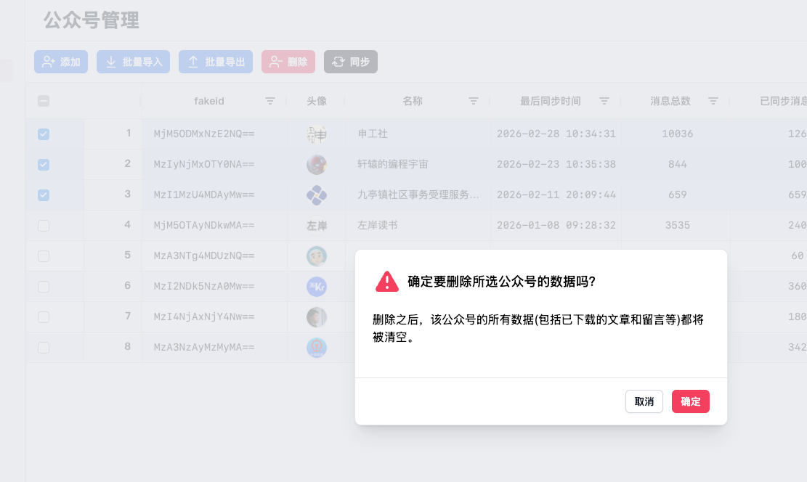

### 方法 2：通过开发者工具清除全部数据

适用于需要清除所有公众号数据的情况：

1. 按 `F12` 或右键页面选择「检查」，打开浏览器开发者工具
2. 切换到「Application」（应用）标签页
3. 在左侧展开「IndexedDB」
4. 找到网站对应的数据库，点击【删除数据库】

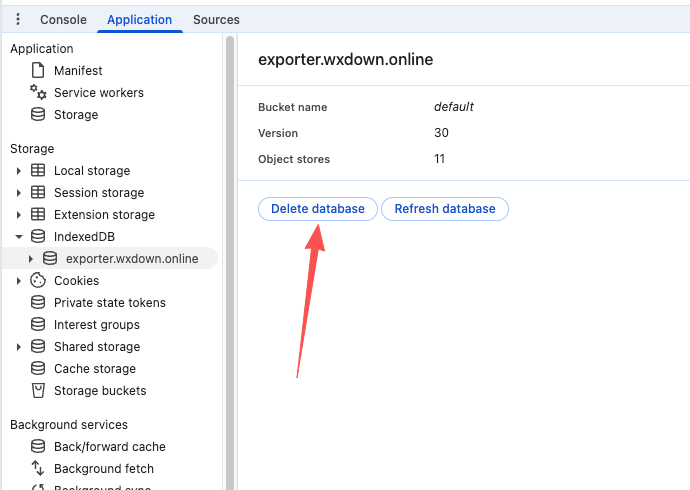

### 方法 3：通过浏览器设置清除站点数据

此方法会清除该网站的所有本地数据（包括 IndexedDB、Cookie、登录状态等）：

1. 在 Chrome 地址栏输入 `chrome://settings/content/all?searchSubpage=mptext.top` 并回车
2. 找到 `down.mptext.top` 域名
3. 点击右侧的垃圾桶图标删除该站点的所有数据

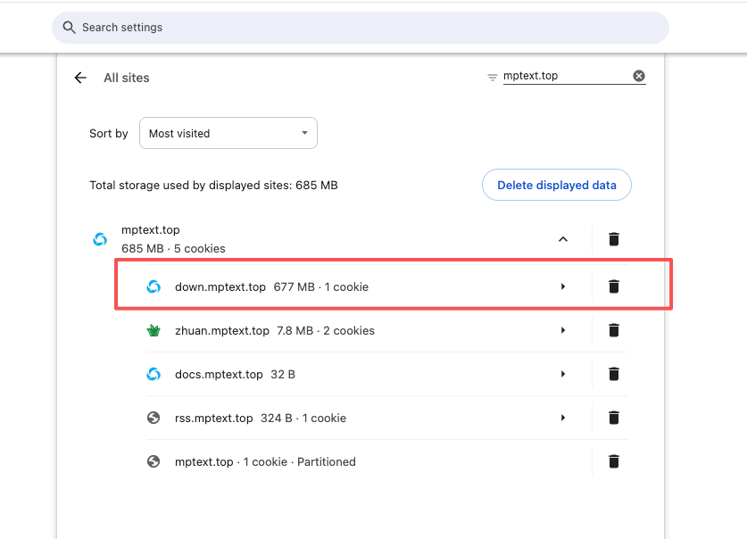

## 如何检查请求失败原因？

当遇到数据获取失败时，可以通过浏览器开发者工具查看具体的网络请求和错误信息：

### 第一步：打开开发者工具

通过菜单打开：
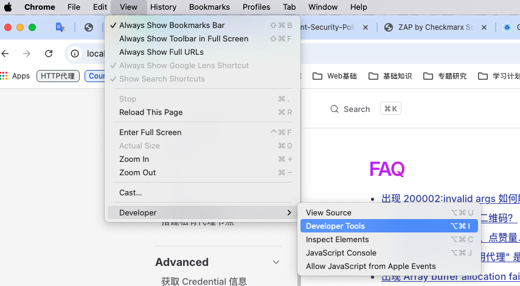

或者在网页上右键，选择「检查」（Inspect）：
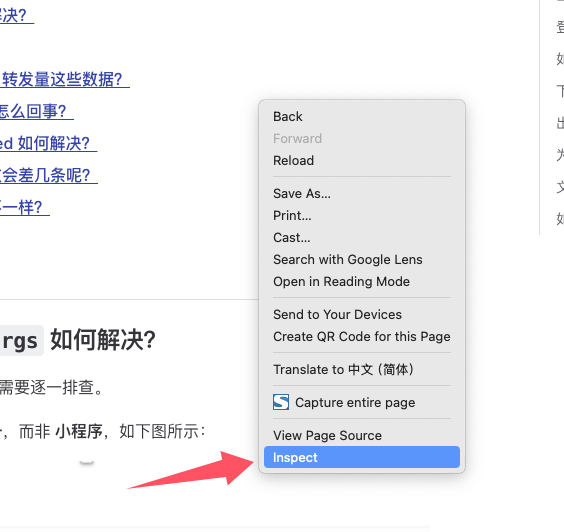

### 第二步：捕获网络请求

1. 切换到「Network」（网络）面板
2. 点击清空按钮清除已有记录
3. 在页面上进行你的操作（如抓取评论）
4. 操作完成后，查看网络面板中的请求和响应内容

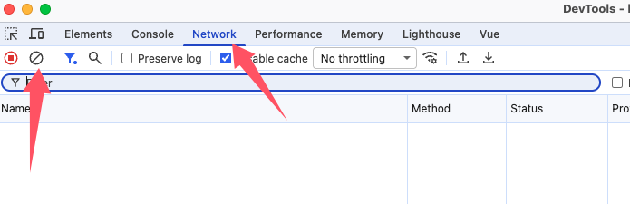

如果不确定如何分析，可以将请求详情截图发到 QQ 群中寻求帮助。
