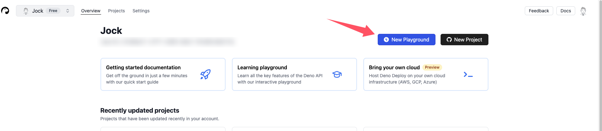
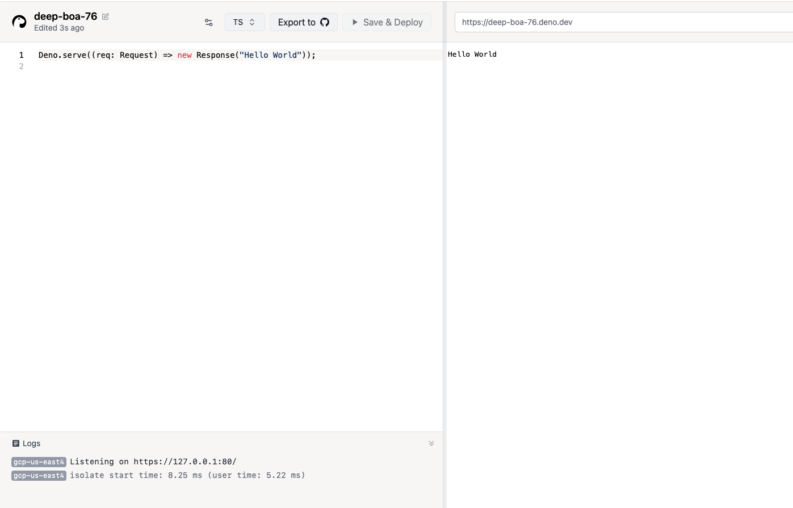
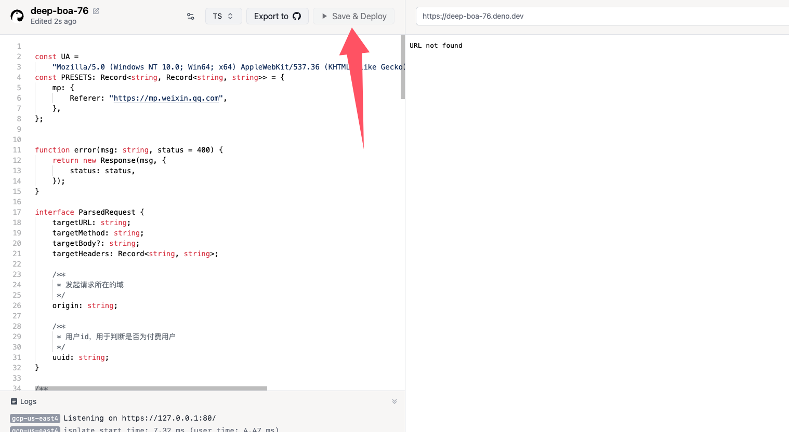

# 搭建私有代理节点

私有代理节点部署在各种 serverless 环境（**都是国外的平台，所以在使用时最好配合翻墙软件**），可以加速资源的下载进度。但由于目前节点代码并没有进行身份验证，所以请避免部署后的节点地址遭到泄露。如若发现节点流量异常，请销毁节点重新进行搭建(即更换节点地址)。

如果使用的 Cloudflare 部署的节点，也可以使用自定义规则限制可访问的域名，详情见下面的安全设置。

::: details 点我查看节点代码
```js
const UA =
    "Mozilla/5.0 (Windows NT 10.0; Win64; x64) AppleWebKit/537.36 (KHTML, like Gecko) Chrome/100.0.0.0 Safari/537.36";

const PRESETS = {
    mp: {
        Referer: "https://mp.weixin.qq.com",
    },
};


function error(msg, status = 400) {
    return new Response(msg, {
        status: status,
    });
}


/**
 * 解析请求
 */
async function parseRequest(req) {
    const origin = req.headers.get("origin") || '*';

    // 代理目标的请求参数
    let targetURL = '';
    let targetMethod = "GET";
    let targetBody = '';
    let targetHeaders = {};
    let preset = '';

    const method = req.method.toLowerCase();
    if (method === "get") {
        // GET
        // ?url=${encodeURIComponent(https://example.com?a=b)}&method=GET&headers=${encodeURIComponent(JSON.stringify(headers))}
        const {searchParams} = new URL(req.url);
        if (searchParams.has("url")) {
            targetURL = decodeURIComponent(searchParams.get("url"));
        }
        if (searchParams.has("method")) {
            targetMethod = searchParams.get("method");
        }
        if (searchParams.has("body")) {
            targetBody = decodeURIComponent(searchParams.get("body"));
        }
        if (searchParams.has("headers")) {
            try {
                targetHeaders = JSON.parse(
                    decodeURIComponent(searchParams.get("headers")),
                );
            } catch (_) {
                throw new Error("headers not valid");
            }
        }
        if (searchParams.has("preset")) {
            preset = decodeURIComponent(searchParams.get("preset"));
        }
    } else if (method === "post") {
        // POST
        /**
         * payload(json):
         * {
         *   url: 'https://example.com',
         *   method: 'PUT',
         *   body: 'a=1&b=2',
         *   headers: {
         *     Cookie: 'name=root'
         *   },
         *   preset: '',
         * }
         */
        const payload = await req.json();
        if (payload.url) {
            targetURL = payload.url;
        }
        if (payload.method) {
            targetMethod = payload.method;
        }
        if (payload.body) {
            targetBody = payload.body;
        }
        if (payload.headers) {
            targetHeaders = payload.headers;
        }
        if (payload.preset) {
            preset = payload.preset;
        }
    } else {
        throw new Error("Method not implemented");
    }

    if (!targetURL) {
        throw new Error("URL not found");
    }
    if (!/^https?:\/\//.test(targetURL)) {
        throw new Error("URL not valid");
    }
    if (targetMethod === "GET" && targetBody) {
        throw new Error("GET method can't has body");
    }
    if (Object.prototype.toString.call(targetHeaders) !== "[object Object]") {
        throw new Error("Headers not valid");
    }
    if (!targetHeaders["User-Agent"]) {
        targetHeaders["User-Agent"] = UA;
    }

    // 增加预设
    if (preset in PRESETS) {
        Object.assign(targetHeaders, PRESETS[preset]);
    }

    return {
        origin,
        targetURL,
        targetMethod,
        targetBody,
        targetHeaders,
    };
}

/**
 * 代理请求
 */
function wfetch(url, method, body, headers = {}) {
    return fetch(url, {
        method: method,
        body: body || undefined,
        headers: {
            ...headers,
        },
    });
}

export default {
    async fetch(request) {
        try {
            const {
                origin,
                targetURL,
                targetMethod,
                targetBody,
                targetHeaders,
            } = await parseRequest(request);

            // 代理请求
            const response = await wfetch(
                targetURL,
                targetMethod,
                targetBody,
                targetHeaders,
            );

            return new Response(response.body, {
                headers: {
                    "Access-Control-Allow-Origin": origin,
                    "Access-Control-Max-Age": "86400",
                    "Content-Type": response.headers.get("Content-Type"),
                },
            });
        } catch (err) {
            return error(err.message);
        }
    }
}
```
:::


目前该节点代码可部署在以下平台：

- [Cloudflare Worker](https://workers.cloudflare.com/)
- [Deno Deploy](https://deno.com/deploy)

> 注意：
> Deno Deploy 改版后要求 **绑定信用卡** 才可使用之前的免费额度，所以 **推荐使用 Cloudflare 平台搭建节点**。
> 


## 部署到 Cloudflare Workers

打开控制台的左侧【计算和AI】下面的【Workers 和 Pages】菜单，点击【创建应用程序】，创建一个新的 worker，如下所示：


选择【从 Hello World! 开始】


部署之后，点击【编辑代码】，将节点的代码替换为我们自己的代码（节点代码从本文档上面拷贝）：


返回【URL not found】就表示节点部署成功了，我们的节点地址(url)就可以配置到网站中进行使用了。


### 绑定自定义域名

> worker 自动生成的域名(比如上面例子中的`https://gentle-firefly-af03.markortese3.workers.dev`)通常需要翻墙才能访问，通过配置自定义域名，可缓解 cloudflare 域名被墙的问题。
> 
> 实测下来，虽然用自定义域名不需要翻墙即可访问，但速度会有一些下降。如果有条件的话，还是开启翻墙软件进行使用。

#### 1. 购买域名

若手里还没有自己的域名，则推荐从 [SpaceShip](https://www.spaceship.com/zh/domain-search/?tab=domains&query=) 处购买，支持支付宝支付。
可以选择`.site`或者`.online`等后缀的域名，首年价格较低。

#### 2. 将域名添加到 Cloudflare

在【账户主页】点击【加入域】，如下所示：


将域名填入，其他保留默认设置，点【继续】：


选择免费计划：


最后，需要修改 SpaceShip 上面的设置，如下：


打开 SpaceShip 上面你刚购买的那个域名的高级DNS设置页面，如下：


这两处设置对应 Cloudflare 上面要求修改的两处。


这两处设置完之后，需要等待一段时间，等 Cloudflare 更新就可以了。

之后如果想重新启用域名的 DNSSEC，可以在 Cloudflare 中点下面这里，如下所示：


会得到一些配置值，如下：


回到 SpaceShip，在【高级DNS】中添加一条DS记录，如下所示：


> 【关键标签】对应【密钥标记】


设置完之后等待就可以了。

到此，我们已成功的将我们的域名托管给 Cloudflare 进行管理了。

#### 3. 给 worker 添加自定义域

在 worker 的设置里，添加【自定义域】，如下：


这里可以输入任意的二级域名，比如`1235566.space`是我刚注册的域名，我可以在前面添加`00.`表示一条访问节点地址，如下所示：


添加完之后，我就可以通过`00.1235566.space`访问这个代理节点了，如下：


你可以在同一个 worker 上面添加多个这样的【自定义域】，这样就会得到多个节点地址。
比如，公共代理节点的配置如下：


### 安全设置

> 针对绑定了自定义域名的账户

如果想限制你的私有节点只能被特定域名使用，可以在 Cloudflare 控制台添加过滤规则，如下所示：


通过限制【引用方】，也就是 HTTP 请求中的`referer`必须为特定域名才可访问。


上面这个示例配置表示，只有`https://www.example.com`网站可以使用该节点，其他网站使用时会自动被阻止，一般会返回下面这样的错误：


## 部署到 Deno Deploy

### 视频版


<iframe src="https://github.com/user-attachments/assets/8269becd-56a3-4d82-9aca-345b53a36d76" scrolling="no" border="0" frameborder="no" framespacing="0" allowfullscreen="true" style="width:100%;height:400px;"></iframe>

### 文字版

在 Deno Deploy 控制台点击`New Playground`，创建一个项目，如下：



将上面的节点代码拷贝到左侧代码编辑区，并点击`Save & Deploy`按钮：



保存成功后，右侧会出现`URL not found`提示，表示代理搭建完成。

复制右侧地址栏中的地址( https://deep-boa-76.deno.dev )，配置进页面中即可使用。
