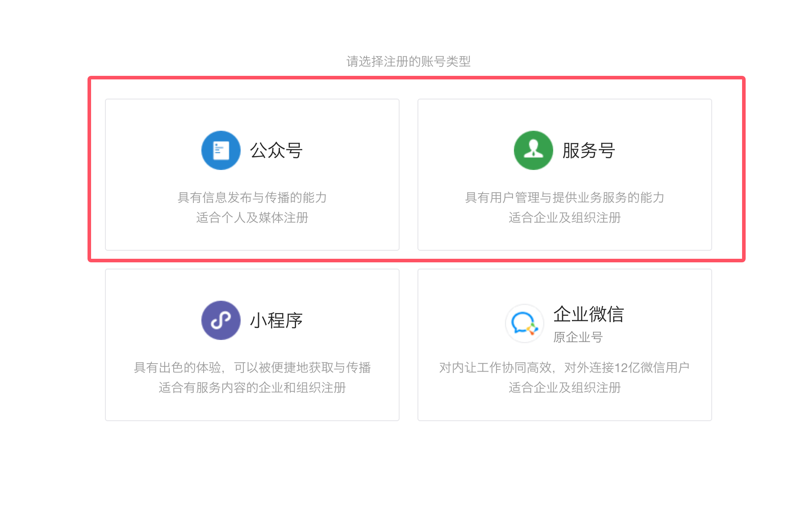
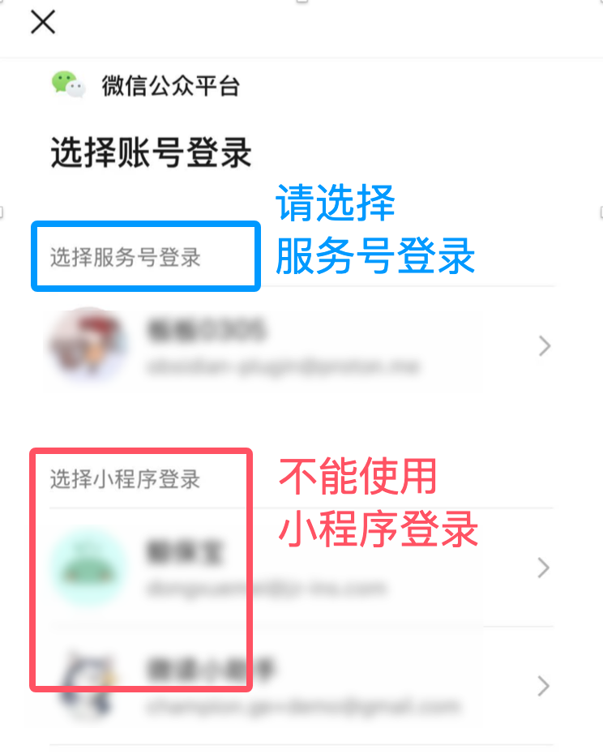
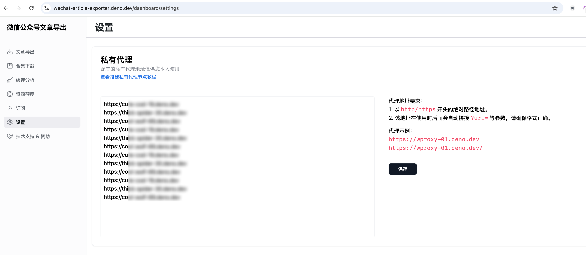
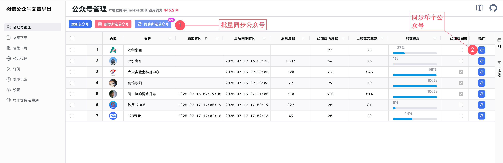
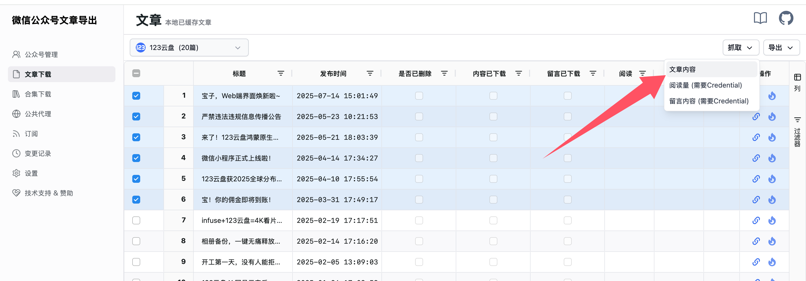
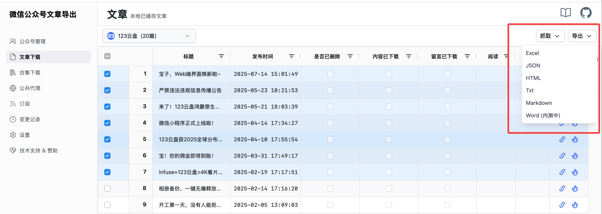
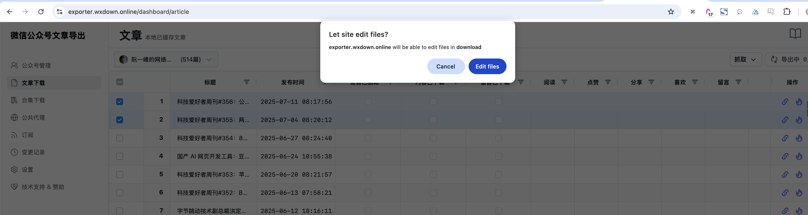

# 快速上手

## 1. 注册一个微信公众号

::: tip 提示
若你已经有一个可用的 **订阅号** 或者 **服务号** 的话可跳过该步骤。
:::

前往 [微信公众平台](https://mp.weixin.qq.com/cgi-bin/registermidpage?action=index&lang=zh_CN) 进行注册，公众号(原订阅号)和服务号皆可。

## 2. 二维码扫码登录

注册完公众号之后，进入网站的 [登录页面](https://down.mptext.top/login)，用微信扫描页面上的二维码，选择自己注册的 **公众号** 进行登录。

::: tip 提示
注意，这里必须选择 **公众号** 或者 **服务号** 进行登录，不能使用 **小程序** 登录，否则后续无法获取数据。
:::

## 3. 配置私有代理 (推荐)

::: tip 提示
该步骤为可选项，若不配置的话，默认走公共代理 (公共代理资源有限，参考 [代理节点](proxy))

查看 [搭建私有代理节点](private-proxy) 教程来搭建自己的私有代理。

配置的代理越多，下载文章内容时就越快，因此尽量配置多一些代理 (**推荐不少于5条**)。
:::

在设置页面配置私有代理地址，如下所示：

## 4. 添加公众号，开始抓取文章链接

在 [公众号管理](https://down.mptext.top/dashboard/account) 页面添加一个公众号，通过同步按钮拉取该公众号的所有文章链接。

## 5. 下载文章内容并导出数据

在 [文章下载](https://down.mptext.top/dashboard/article) 页面选择目标公众号，勾选对应的文章，通过右上角的【抓取】下载文章内容，如下图所示：

::: tip 提示
如果配置了该公众号的 Credentials，也可以抓取该公众号文章的 **阅读量** 和 **评论** 数据。
:::

最后，选择导出，可导出的格式有 **excel / json / html / txt / markdown / word**，如下图所示：

::: tip 提示
当导出 **html / txt / markdown / word** 等格式时，选择导出目录后浏览器会提示【是否允许网站编辑指定目录的文件】，如下图所示：

这里需要选择允许，这样在导出时网站会实时写入文件到该目录。

技术细节可以参考 [File_System_API](https://developer.mozilla.org/en-US/docs/Web/API/File_System_API)
:::
