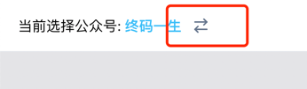
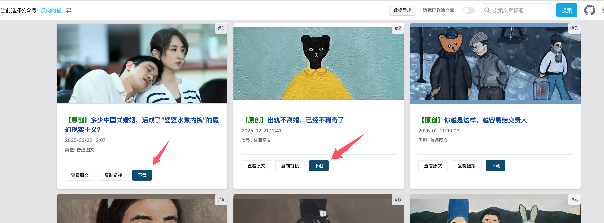
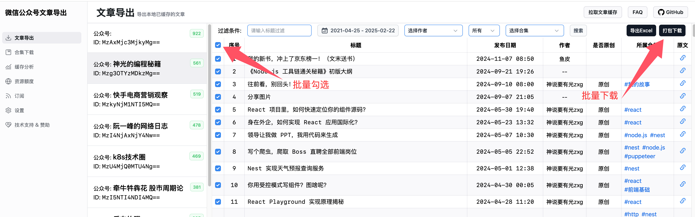

# 如何使用？

## 1. 注册一个微信公众号

::: tip 提示
已有订阅号/服务号的话可跳过该步骤
:::

前往 [微信公众平台](https://mp.weixin.qq.com/cgi-bin/registermidpage?action=index&lang=zh_CN) 进行注册，公众号(原订阅号)和服务号皆可。

## 2. 二维码扫码登录

进入网站的 [登录页面](https://exporter.wxdown.online/login)，用微信扫描页面上的二维码，然后选择自己注册的 **公众号** 进行登录。

::: tip 提示
注意，必须选择公众号/服务号登录，不能使用小程序登录。
:::

## 3. 配置私有代理 (推荐)

::: tip 提示
该步骤为可选项，若不配置的话，默认走公共代理 (公共代理资源有限，参考 [代理节点](proxy))

查看 [搭建私有代理节点](private-proxy) 教程。
:::

在设置页面配置私有代理地址，如下所示：

## 4. 搜索目标公众号，开始下载文章

通过 [网站首页](https://exporter.wxdown.online/) 左上角的公众号切换按钮，搜索自己感兴趣的公众号，如下图所示：

搜索到文章之后，可单篇下载，如下图所示：

也可以进入后台界面，通过批量勾选文章进行批量下载，如下图所示：

