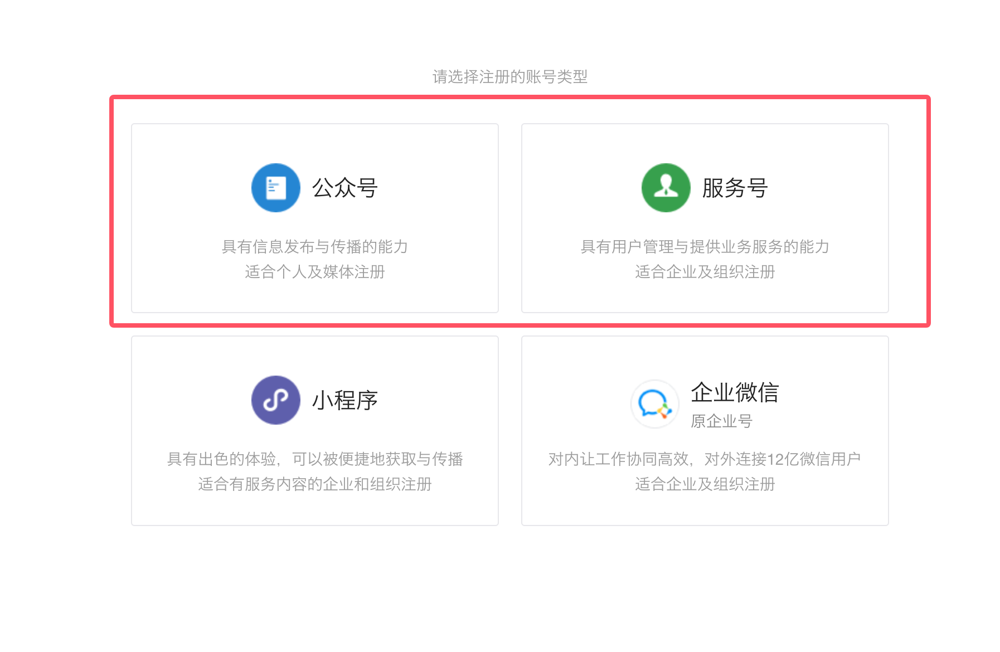
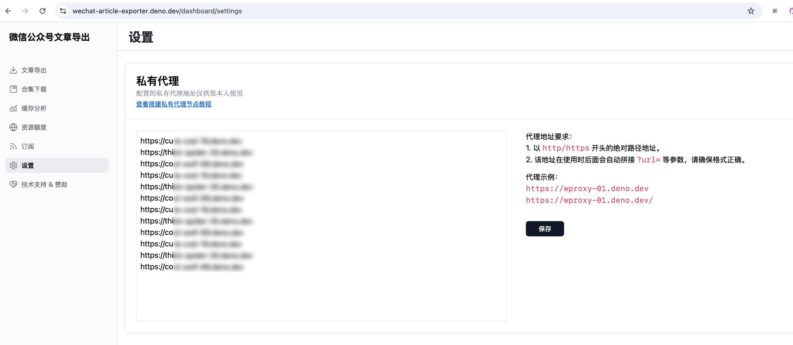
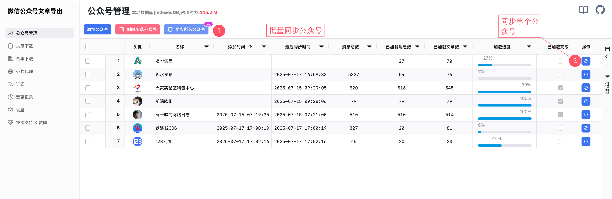
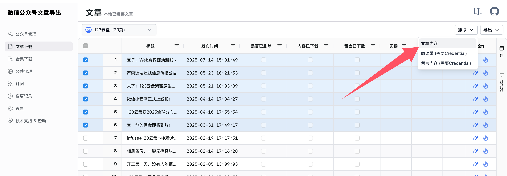
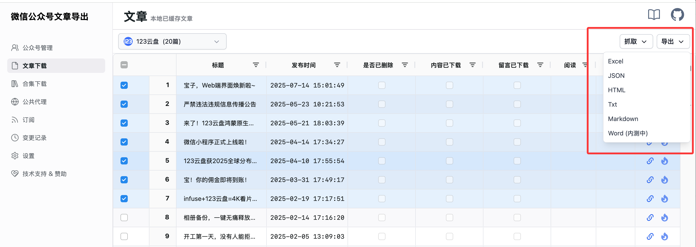
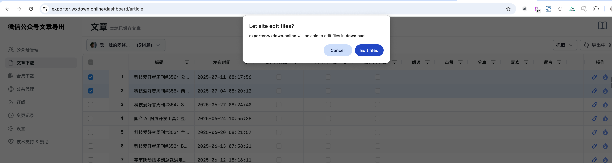

# 快速上手

## 1. 注册一个微信公众号

::: tip 提示
若你已经有一个可用的 **订阅号** 或者 **服务号** 的话可跳过该步骤。
:::

前往 [微信公众平台](https://mp.weixin.qq.com/cgi-bin/registermidpage?action=index&lang=zh_CN) 进行注册，公众号（原订阅号）和服务号皆可。

## 2. 扫码登录

进入网站首页，点击【登录】按钮，用微信扫描页面上的二维码，选择你注册的 **公众号** 进行登录。

::: warning 注意
必须选择 **公众号** 或 **服务号** 进行登录，**不能使用小程序登录**，否则后续无法获取文章数据。
:::

登录成功后，系统会生成一个 API 密钥（auth-key），有效期为 4 天。过期后需要重新扫码登录。

## 3. 配置代理节点（推荐）

下载文章内容时需要通过代理节点转发请求。不配置的话默认使用公共代理，但公共代理资源有限（每个节点每天 10 万次请求），建议搭建自己的私有代理以获得更好的下载体验。

::: tip 为什么需要代理？
微信文章的图片和内容有跨域和防盗链限制，代理节点用于绕过这些限制。代理节点越多，并发下载速度越快（系统会自动轮询和负载均衡），**推荐配置 5 个以上节点**。
:::

- 查看 [公共代理节点](proxy) 了解当前可用的公共节点
- 查看 [搭建私有代理节点](private-proxy) 教程搭建你自己的代理

在设置页面配置代理地址：

## 4. 添加公众号，同步文章列表

在【公众号管理】页面搜索并添加目标公众号，点击【同步】按钮拉取该公众号的全部文章列表。

::: tip 提示
目标公众号需要开启「允许通过名称搜索」功能，否则可能搜索不到。每次同步最多拉取 20 条消息（微信接口限制），系统会自动翻页直到全部拉取完成。
:::

## 5. 下载文章内容并导出

在【文章下载】页面选择目标公众号，勾选需要的文章，点击右上角的【抓取】按钮下载文章内容：

你可以通过以下条件筛选文章：
- **作者**：按文章作者过滤
- **标题关键词**：搜索文章标题
- **发布时间范围**：指定起止日期
- **是否原创**：只看原创文章

::: tip 抓取阅读量和评论
如果需要抓取文章的阅读量、点赞数和评论数据，需要先配置对应公众号的 Credentials。详见 [抓取 Credentials](../advanced/wxdown-service)。Credentials 有效期约 25 分钟，过期后需要重新获取。
:::

最后，点击【导出】选择格式，支持 **Excel / JSON / HTML / TXT / Markdown / Word** 六种格式：

| 格式 | 说明 |
|------|------|
| Excel | 表格形式，包含标题、作者、发布时间、链接等元数据 |
| JSON | 结构化数据，适合程序处理 |
| HTML | 高保真还原，包含图片和原始样式 |
| Markdown | 纯文本标记格式，适合二次编辑 |
| TXT | 纯文本，仅保留文字内容 |
| Word | DOCX 格式，适合离线阅读和打印 |

::: tip 关于文件导出
导出 HTML / TXT / Markdown / Word 格式时，浏览器会请求文件系统写入权限，如下图所示：

请点击【允许】，这样导出时文件会实时写入到你选择的目录中。该功能基于浏览器的 [File System API](https://developer.mozilla.org/en-US/docs/Web/API/File_System_API) 实现。
:::
