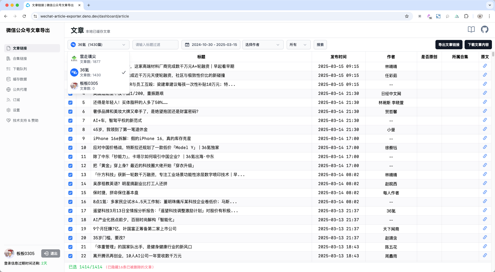
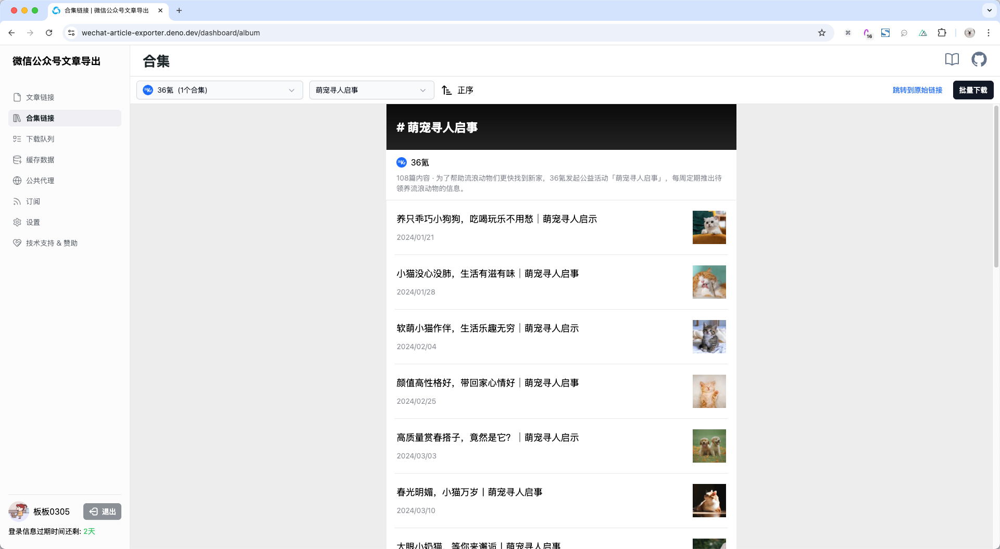
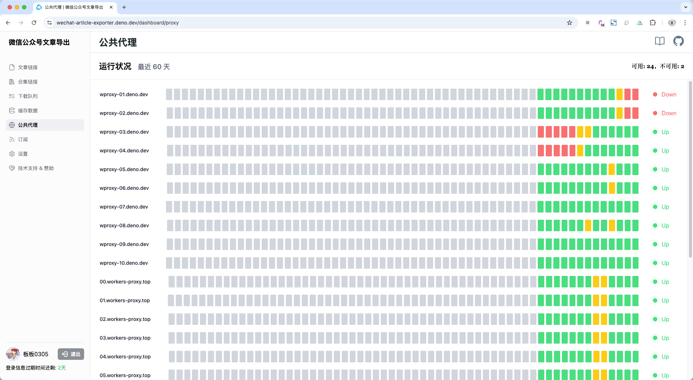

---
# https://vitepress.dev/reference/default-theme-home-page
layout: home

hero:
  name: 微信公众号文章下载
  text: 
  tagline: 一款 开源 & 免费 的公众号文章下载工具
  image:
    src: /logo.png
    alt: 公众号文章下载
  actions:
    - theme: brand
      text: 开始使用
      link: https://wechat-article-exporter.deno.dev/
    - theme: alt
      text: 查看教程
      link: /get-started/usage

features:
  - title: 无需安装
    details: 在线使用，不需要配置复杂的本地环境 (下载评论数据时需要配合本地的抓包软件)
  - title: 支持搜索
    details: 支持公众号搜索，号内文章搜素（标题关键字）
  - title: 文章下载
    details: 下载 HTML 格式，保证高保真还原文章版式
  - title: 文章过滤
    details: 下载时支持文章过滤，包括作者、标题、发布时间、是否原创、所属合集等
  - title: 合集下载
    details: 支持公众号内合集文章的批量下载
  - title: 内嵌的音视频
    details: 支持内嵌的音视频下载
  - title: 元数据
    details: 支持评论、阅读量、点赞量等各种元数据的抓取
  - title: 格式转换 (计划中)
    details: 支持将下载的 HTML 原始格式转为 PDF / 图片 / Markdown 等格式
  - title: API (计划中)
    details: 支持通过 API 调用
---

## 界面展示

### 抓取指定公众号的文章链接

### 文章批量导出

### 合集下载

### 公共代理运行状况

<a href="https://wechat-article-exporter.deno.dev/" target="_blank">前往使用</a>
