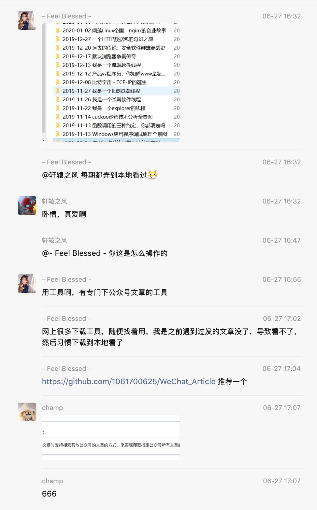
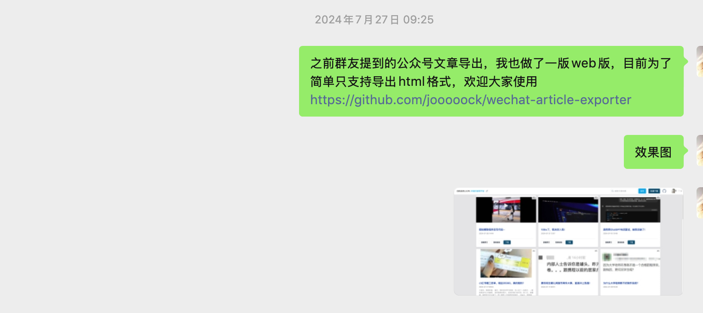

# 关于更换域名的一些事

这篇文章我想聊聊关于这个项目的域名变化背后的故事，也作为到目前为止我本人对这个项目的一个总结。

## 项目的起源

这个项目起源于在一个微信群中群友关于公众号文章下载的一个工具的分享，如下：

我在之前也没想过公众号文章还能有这种接口可以获取，所以看到这个项目的原理后很是激动，虽然我本人对公众号文章下载本身没什么兴趣，但是由于对 js 逆向很感兴趣，所以就打算搞搞看（之前曾搞过微信读书的书籍下载，所以对微信的web端产品都想研究一番）。

经过一个月的努力，终于做出了第一个可使用版本：

贴一下当时的效果图：

这就是该工具的第一版(v1.0)。

## 域名的变化

这个项目起初是部署在 Deno Deploy 上面的（地址是 https://wechat-article-exporter.deno.dev 现在已经重定向到了 https://exporter.wxdown.online,当然后面也会重定向到新的域名），因为我之前的几个工具项目都是在 Deno 上面的，所以比较熟悉这个平台。

刚开始完全就是对逆向的兴趣所驱动，但是真的做出来之后就会希望被更多人使用，会为了star数而去不断的完善它。

随着功能不断的增多，文档部分也变得越来越多，所以就独立出单独的一个 docs 项目，用 vitepress 搭建，地址是 https://wechat-article-docs.deno.dev

但是后面随着 deno.dev 域名被墙，导致 Deno 平台相比 Cloudflare 没什么优势了，所以就把项目部署到了 Cloudflare 上面了，借这个机会也注册了新的域名`wxdown.online`，就是现在大家看到的 https://exporter.wxdown.online 和 https://docs.wxdown.online。

但是，由于当时部署这个项目所创建的 Cloudflare 用的是临时邮箱注册的，所以导致后面电脑出了一点问题，浏览器自动记住的密码丢失了，现在已经无法登录那个账号了。由于`wxdown.online`已经关联了那个账号上面的项目，所以就导致现在无法再绑定另一个 Cloudflare 账号下的项目。所以我就又注册了一个域名`mptext.top`，这次就用了我的主邮箱注册了 Cloudflare 并部署了该项目。

所以，总的来说，后面这个项目的公共网站地址为 https://down.mptext.top，文档地址为 https://docs.mptext.top。

现在的这个域名(`wxdown.online`)会一直到域名到期(2026年4月2日)，之后将不再续期。对应的网站也将不可用，**请妥善处理已缓存的数据**。

## 项目后续的发展

首先我不确定这种项目能够存活多久，但我会尽力去更新维护它，也是我对赞助我的朋友们的一个交代(后续我也打算用赞助的费用开一个 Cloudflare 的付费计划，毕竟“取之于民，用之于民”嘛)。

等新域名上线之后，更新频率会回到正轨上来(之前曾因为密码丢失问题断更了好久)，后面会优化各种bug与细节。

很多人比较关注的订阅功能，我打算另起一个项目去做，这个项目就专心做历史文章的下载了，新项目暂时不打算开源，根据后续具体的结果会出会员版(如果我觉得效果不好，可能就不会出了，到时希望朋友们多多支持)。
