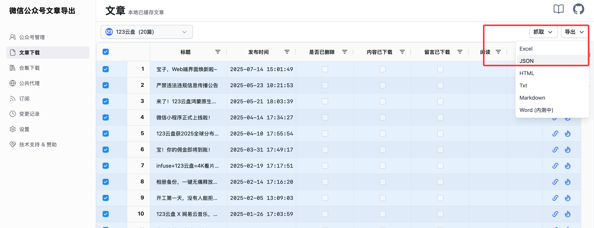

# 如何批量导出某个公众号的全部文章链接？

:::info 本文需要的工具
1. 一个微信 **订阅号** 或 **服务号** (没有的话，可以去 [微信公众平台](https://mp.weixin.qq.com/cgi-bin/registermidpage?action=index&lang=zh_CN) 免费注册)
2. [微信公众号文章导出工具](https://exporter.wxdown.online/)
:::

:::warning 注意
如果目标公众号关闭了搜索功能，则本文的方法无效。

:::

## 1. 注册公众号

::: tip 提示
若你已经有一个可用的 **订阅号** 或者 **服务号** 的话可跳过该步骤。
:::

前往 [微信公众平台](https://mp.weixin.qq.com/cgi-bin/registermidpage?action=index&lang=zh_CN) 进行注册，公众号(原订阅号)和服务号皆可。

## 2. 登录网站

注册完公众号之后，进入网站的 [登录页面](https://exporter.wxdown.online/login)，用微信扫描页面上的二维码，选择自己注册的 **公众号** 进行登录。

::: tip 提示
注意，这里必须选择 **公众号** 或者 **服务号** 进行登录，不能使用 **小程序** 登录，否则后续无法获取数据。
:::

## 3. 添加公众号，开始抓取文章链接

在 [公众号管理](https://exporter.wxdown.online/dashboard/account) 页面添加一个公众号，通过同步按钮拉取该公众号的所有文章链接。

## 4. 导出链接

在 [文章下载](https://exporter.wxdown.online/dashboard/article) 页面选择目标公众号，勾选对应的文章，通过右上角的【导出】选择导出excel/json，如下图所示：

