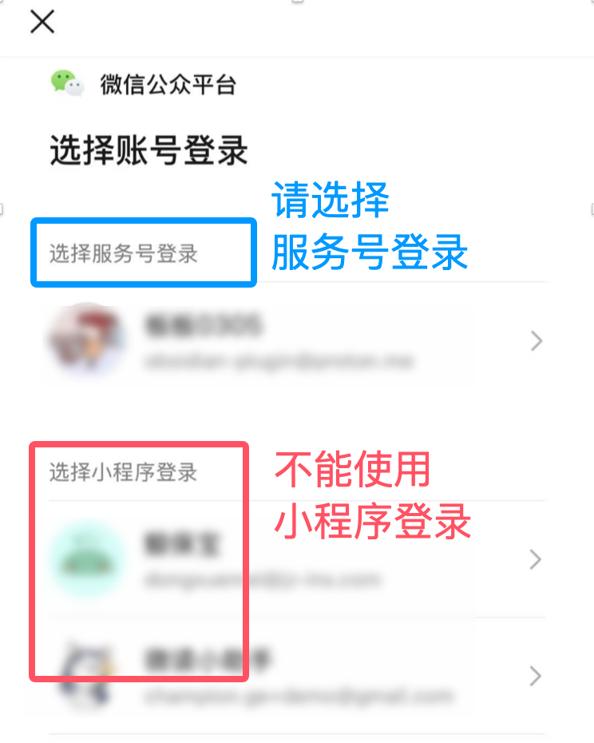

# 如何批量导出某个公众号的全部文章链接？

:::info 本文需要的工具
1. 一个微信服务号或订阅号 (没有的话，可以去 [微信公众平台](https://mp.weixin.qq.com/cgi-bin/registermidpage?action=index&lang=zh_CN) 免费注册)
2. [微信公众号文章导出工具](https://wechat-article-exporter.deno.dev/)
:::

:::warning 注意
如果目标公众号关闭了搜索功能，则本文的方法无效。

:::

## 1. 注册公众号

::: tip 提示
已有订阅号/服务号的话可跳过该步骤
:::

前往 [微信公众平台](https://mp.weixin.qq.com/cgi-bin/registermidpage?action=index&lang=zh_CN) 进行注册，公众号(原订阅号)和服务号皆可。

## 2. 登录网站

进入网站的 [登录页面](https://wechat-article-exporter.deno.dev/login)，用微信扫描页面上的二维码，然后选择自己注册的 **公众号** 进行登录。

::: tip 提示
注意，必须选择公众号/服务号登录，不能使用小程序登录。
:::

## 3. 搜索目标公众号

通过 [网站首页](https://wechat-article-exporter.deno.dev/) 左上角的公众号切换按钮，搜索目标公众号，如下图所示：

## 4. 抓取文章链接

通过翻页的方式将该公众号内的所有文章都抓取下来，右下角的加载进度可以检查是否抓取完整，如下图所示：

:::danger 警告
如果文章太多(超过50页)，最好不要短时间内抓取所有，否则很容易触发微信的限制，导致公众号相关接口被封。

也可以使用自动翻页的方式，但此方式因为以上原因存在封号的风险，酌情使用。
:::

## 5. 导出链接

通过右上角的菜单【数据导出】进入到后台，如下图所示：

按照下面的步骤进行操作：

最后，看一下导出的结果：

